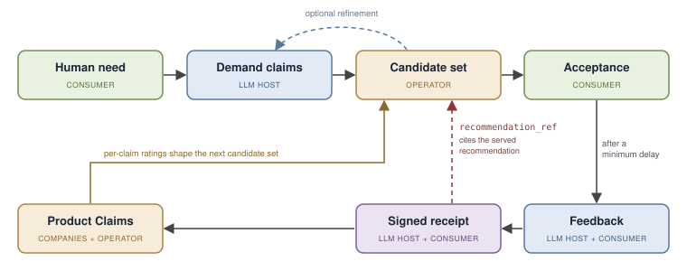

# Competing on Quality, Not Attention

## Contents

- [§0 Abstract](#0-abstract)
- [§1 Centralized power via information asymmetry](#1-centralized-power-via-information-asymmetry)
- [§2 Involved parties](#2-involved-parties)
- [§3 Core mechanism at altitude](#3-core-mechanism-at-altitude)
- [§4 Identity & privacy](#4-identity--privacy)
- [§5 Scoring & incentives](#5-scoring--incentives)
- [§6 Transparency model](#6-transparency-model)
- [§7 The demand commons](#7-the-demand-commons)
- [§8 Operator neutrality](#8-operator-neutrality)
- [§9 References](#9-references)
- [Appendix A. Per-surface attack map](#appendix-a-per-surface-attack-map)

## §0 Abstract

Control over how humanity discovers products and services is centralizing again. LLM hosts are becoming the interface between people and the digital world, the point where a person states a need and receives an answer, and whoever owns that orchestration between human demand and the world's supply owns the most valuable commercial dataset ever produced. This is the same convenient gateway that search engines, marketplaces, and social platforms each turned into a monopoly or oligopoly, after which the extraction of social welfare ramped up long before regulation caught up. It is happening again, on a larger surface, and the dataset will be produced whether or not anyone intends it. The only open question is who holds it. The default is that the dataset, and the recommendation engine built on it, come to rest inside a single private company, at a concentration of power no prior gateway reached and no government could match. This paper proposes the alternative.

The deeper problem underneath is old. Money made one half of every transaction measurable roughly 2,500 years ago, the price a buyer gives; the other half, the quality a buyer gets, never got its own unit of account, and reputation, brands, seals, and ratings are all stand-ins corruptible by the party they are meant to discipline. What is new is that LLM agents can finally map a stated need to specific claims accurately enough to make quality accountable at the point of decision, which is what turns an overdue problem into a solvable one now.

ORP (Open Receipt Protocol) is a reciprocal public-good protocol for accountable discovery. Companies register claims about their products. LLM Hosts facilitate recommendations and feedback. Verified humans contribute the claim-specific judgments. Those contributions build graphs of supply, demand and accountability. The structure, commitments, and aggregate signals of all three are public; individual conversations and identities stay private throughout. A neutral non-profit operator or a federation of such maintain the graphs but may sell no influence over them.

A worked pass through the loop: a person asks their assistant for an app that teaches French with short daily lessons. The host turns that need into demand claims and sends only those to the operator, which matches them against the claims companies have registered and returns a small candidate set with each candidate's per-claim ratings. The AI Host analyzes the product claim texts and candidate set and makes the best recommendation based on what is available. If the supply metadata suggest a sharper query would do better, the host refines the need with the person and queries again. If the person accepts a recommendation, the host later asks whether the product delivered on the specific claims it was chosen for, and the confirmed 1-to-5 scores become a receipt signed by the host and the verified human. The receipt lands in the append-only registry and updates the public ratings of exactly those claims, so the next person who states the same need sees products ranked by what they actually delivered.

The contribution is the accountability loop: signed rating receipts that reference the exact claims a recommendation was made on, produced by verified humans, tied to a recommendation the operator itself served, and held by an operator with nothing to sell. The matching around that loop is assembled from standard parts. A host that runs its own version of this cannot write these receipts, because everyone can see whose thumb is on the scale. This is what makes the quality signal hard to fake and hard to buy retroactively.

Early modeling of this dynamic points the same way. In a simulated agent-first market, where users state needs before choosing a platform (Hong et al. 2026), presentation manipulation occupies 73 to 78 percent of first-ranked positions, and host-authored outcome feedback reduces it only to 36 to 41 percent. The result is consistent with the thesis this paper argues: platform-authored accountability helps but leaves a large residual, and the missing piece is a record the platform cannot write, held by an operator that owns nothing.

The intended result is a market that competes more on product quality and price and less on purchased attention, delivered alongside a public, continuously updating map of supply, demand, and quality signals. By reducing the information asymmetry that attention spend exploits, it narrows advertising toward its one honest function, informing people of genuine novelty. None of this depends on inventing new technology. The hard parts are assembled from proven components, so what stands between the thesis and a working system is endorsement, funding, and disciplined engineering. No research breakthrough is required.

Independent work of the last two years converges on the pieces this paper assembles: neutral data stewards and trust brokers as the missing institutional layer (Zable & Verhulst 2026), trust and provenance infrastructure for LLM-mediated information environments (Marchal et al. 2026), and gatekeeper conduct made checkable by recomputation (Kroehl 2026).

The window to shape this gateway is open while the industry is in transition and closes once the gateway sets. The core statement of this paper is: "The risk and opportunity are well understood and a social welfare positive solution is possible this time around. Please help make that a reality."

### Scope and altitude

This paper presents ORP's v1.0 thesis and at least one coherent, technically possible way to implement each of its hard parts. It is neither a startup roadmap nor a full technical specification. Its job is to defend the thesis, that a quality signal a platform cannot write, held by an operator with nothing to sell, is both necessary and buildable. Deep mechanism (wire formats, matching math, receipt and identity cryptography, and scoring formulas) lives in the companion Technical Overview, cited throughout as [Technical Overview §Tn].

Three altitudes run through the document. The core thesis and its load-bearing mechanisms are argued with rigor. Some practical optimization problems (personhood, cold start, operator trust) are shown with a realistic intermediate step whose cost is not commensurate with the benefit the thesis delivers. Detail that is comparatively negligible in consequence, and mechanism that belongs in the companion specification, is scoped out by name with its reason.

A paper about claim accountability owes one disclaimer about its own claims. This is a draft contribution written in a finished register, not a finished architecture: it argues a thesis and shows one way to build it, and it does not pretend to have found every flaw in its own design or an optimal solution. It invites the scrutiny a claim-accountability protocol should hold itself to.

## §1 Centralized power via information asymmetry

One problem runs through this paper: control over how demand meets supply keeps centralizing, and the mechanism of that centralization is an information asymmetry older than any platform. This section states the problem, its cost, its cause, and the reason it can be challenged now. Two objections recur. A reader who grants the problem may still ask why it must be solved now, and a reader who grants the urgency may still believe quality signal is unfixable in principle. Both are answered below.

### The danger

LLM hosts are likely to become an unprecedented centralized interface between humans and the digital world, the next step in a well-established line of threats and opportunities in how consumers and companies exchange information: product discoverability, distribution, and accountability. The predecessors are familiar: search engines, marketplaces, and social media. Each provides a convenient service or gateway, and the information efficiency of the internet reliably turns that gateway into a monopoly or oligopoly, the pattern the Furman review found across digital markets, where "in many cases, digital markets are subject to 'tipping' in which a winner will take most of the market" and "competition for the market cannot be counted on, by itself" (Digital Competition Expert Panel 2019).

This is not a fear about one bad actor but a pattern with overwhelming precedent, and the precedent is evidence, not a history lesson: Amazon, Google, Facebook, and Apple each recognized a comparable centralized position and leveraged it for private benefit, and the rare counterexample, a Steam kept honest by an owner with no need for more, only confirms that owner incentive rather than technical possibility is the variable. Against that record it is beyond reasonable doubt that the LLM-orchestration gateway concentrates the same way unless something is deliberately built to prevent it. Simulation evidence already points the same way: LLM sellers released into reputation-governed e-commerce autonomously learn to exploit that governance (Lei et al. 2026).

### The cost

Once a gateway tips, the extraction of social welfare ramps up, well before regulators wake and catch up. Humanity was repeatedly promised that improving technology and efficiency would produce unprecedented leisure and abundance for everyone (most famously Keynes 1930). But a content person does not need or want anything, and therefore also does not buy anything. Capitalistic growth does not work in a world where most people have everything they want. Products are solutions and you cannot sell solutions without problems.

Digitalization made entertaining, stimulating, and habit-forming content, along with everyday conveniences, virtually free, which allowed platform companies to capture centralized positions and sell human attention to product companies. This allows advertising to escalate human expectations and create endless synthetic demand like never before (the dependence effect: Galbraith 1958). Advertising can escalate expectations this way only because a buyer cannot measure quality before purchase; sellers pay to occupy attention exactly where an honest signal is missing. Which is why modern humans have 1000 mediocre solutions for 1000 inflated problems instead of 20 solutions for 20 problems. We live like royalty and feel like peasants.

AI agents making product recommendations based on what companies are paying for would be the next level of making product quality even less important. ORP aims to incentivize the market back towards quality competition, by connecting accountability of a product to discoverability. The expected consequence is that the synthetic demand industry shrinks until advertising is left with informing consumers of genuine novelty; the macroeconomics of that shift are beyond the scope of this paper.

### Why isn't this solved?

A solution has been theoretically possible for two decades, but the companies who could have built or endorsed it always decided for profit and against social welfare. The obstacle hasn't been technology for a while now: task-based, need-to-product discovery was demonstrated and patented more than a decade before LLM hosts (Carter et al. 2011; Chen et al. 2012). Amazon built a nearly identical structure sixteen years ago and did what a company is supposed to do: it benefited shareholders. Google, Facebook, and their imitators did the same to varying degrees. Regulation failed; companies behaved as companies behave. The European legislature has enacted that failure as a finding, the Digital Markets Act justifying itself on the grounds that antitrust "enforcement occurs ex post and requires an extensive investigation of often very complex facts on a case by case basis" and that "market processes are often incapable of ensuring fair economic outcomes with regard to core platform services" (Regulation (EU) 2022/1925, Recital 5).

Every party positioned to build this was also positioned to own it, and owning it was worth more than opening it. The incumbents still own the enabling technology today: the LLM hosts hold the semantic tooling that makes claim-level mapping practical, exactly as Google and Amazon held their first-mover positions.

### Why it can be challenged now

An adequate information counterpart to money on the quality side would satisfy certain criteria. It would let quality information travel as fast as money moves, and be available at the consumer's decision point (the criterion Jin and Leslie's hygiene grade cards satisfy, and the reason those cards moved seller behavior in addition to sorting consumers). It allows publishing of the supply and demand graphs to improve market efficiency, rather than leaving them privately owned and privately leveraged. It would be hard to fake, and not purchasable. It would be as universal as possible without being hard to understand or hard to author.

Two things that did not exist before make the constraints satisfiable now. The first is technical: LLM agents allow more accurate and more convenient semantic mapping than any prior technology, which is what makes claim-level accountability practical, the textbook certification answer to Akerlof's market-for-lemons problem, applied at a new frontier. The second is institutional, and it arrived with the nature of the technology itself. Artificial intelligence is powerful enough to pose an existential-scale risk to humanity, and that danger produced something no earlier gateway technology did: frontier hosts founded on a mission to humanity rather than on shareholder return, and a public appetite for AI oversight to match. The record of that mission is honest rather than naive. The first frontier lab organized itself as exactly such a mission-bound structure and, under capital pressure, restructured toward the ordinary shareholder form. The structure defected; the alignment did not. Senior researchers left that lab over the defection and founded a competing frontier host on the mission the structure had shed, and it operates at the frontier today. So the observable behavior of this market is not that mission-bound structures are durable. It is that a group of actors with genuine social-welfare alignment persists, and when a structure is captured, rebuilds outside it. Imagine that search engines could have ended the world: there would have been far more competition and far earlier oversight. Compared to previous technology this creates an unprecedented opportunity, where a gateway incumbent can endorse a neutral third party operator, at great economical opportunity cost, out of ideological alignment.

A mission-aligned incumbent willing to act as a neutral ally is the opening this structure has always needed. The ally never owns the data or runs the honeypot. The protocol stays relevant only while at least one frontier host serves it. The alternative to bearing it is not that nobody holds the honeypot. Inaction hands it to the shareholder-aligned hosts currently competing for it, so the choice is not between a neutral operator and no operator, but between a neutral operator and a private one.

The salience of the threat is not a reason to wait for a settled solution but the reason to act now. The transition period the industry is in creates a narrow opening to shape this gateway before it sets rather than after, and the same concentration arrives by default if that opening is missed. The danger is the argument for moving, not against it.

## §2 Involved parties

ORP is a reciprocal public-good protocol for accountable discovery. There is little innovation here, merely an orchestration of known technology and actors. Product companies register claims about what they do. LLM Hosts facilitate recommendations and feedback. Verified humans search products and later rate claims a recommendation was made on. Those contributions build three graphs, supply, demand, and accountability, each independently verifiable by anyone. Their structure, their commitments, and their aggregate signals are public; individual conversations and identities stay private throughout. A neutral non-profit operator maintains the graphs and may sell no influence over them.

Matching is assembled mostly from standard parts. The novelty comes from the separation of data and distribution channel, which is only possible because mission-bound PBC LLM Hosts exist. The resulting structure enables an unprecedented product quality signal, returning companies to compete on quality rather than human attention.

This section states what the protocol does for and through each party, to illustrate why now might be a realistic opportunity to decentralize this type of power.

### Products: claims for discoverability and feedback

A product contributes registered claims about what it does, signs its manifests, and stands behind them as a legally accountable entity, so no claim is anonymous and every fraud case has a defendant. A claim is a reasonably atomic statement about a function that solves a problem, authored in a plain functional register and bound to one product, and it is the discoverability and accountability interface at once: a company earns global discoverability by differentiating its claims into a real market gap, and it earns quality signal by having those claims rated.

In return a product receives free global discoverability for anything meaningfully differentiated, free market-gap analysis, and high-quality feedback from real verified consumers. For a company that delivers differentiated quality the exchange is strongly positive, because discoverability it could previously only buy is now earned by describing the product accurately. For a company whose margin depends on buyers being unable to tell, the same exchange is costly, because it exposes the signal that company relied on obscuring. The trade is unattractive only to those whose position rests on the information asymmetry the protocol reduces. Claim structure, the canonicalization that strips valuative language, and the archive-never-delete lifecycle are in §3 and [Technical Overview §T1].

### Hosts: the party that moves first

A host contributes the translation and the conduct of recommendation. It takes a person's need, expressed in natural language, and turns it into demand claims, the claims a fitting product would likely make. It serves the operator's candidate set, judges conversationally whether to recommend, refine, or stop, and later runs the in-context follow-up that produces receipts. In doing so it gives up ownership of the orchestration and data layer between demand and supply. What it does not give up is its seat between the user and the market: users single-home on one assistant while products multi-home into the registry, the "competitive bottlenecks" configuration of two-sided theory (Armstrong 2006). But a bottleneck is worth what it gates. Telecommunications carriers own the physical gateway to the internet itself, and because they were never permitted to leverage the data crossing it and the world was smart enough not to allow a monopoly of the physical infrastructure, they stayed infrastructure rather than becoming empires. With all three graphs at a neutral operator, every adopting host serves the same quality signal, a user can change assistants without losing it, and the seat stops compounding into the dataset monopoly §1 describes.

The host is the party that has to move first, because nothing in the protocol runs until a host is authoring demand claims, serving recommendations, and running the follow-up. Raw commercial self-interest is not enough to carry that decision for the median host, since the platforms best positioned to adopt earliest are often the ones with the most attention revenue to lose. So the practical trigger is an aligned host, one already positioned against the attention model. Such a host is the right trigger precisely because it does not want to own the data itself: ORP lets it bring a neutral custodian into being without ever holding the honeypot.

- **Install trust, from day one.** One query answers both what actually works for this need and whether it is safe to connect the user to it, binding every recommendation to a legally accountable entity and to feedback the product cannot author or veto. In an ecosystem where a large share of published tool servers ship unauthenticated or exploitable (Zhou et al. 2026), this is a capability worth having on its own. The receipt-envelope mechanism is in §3 ([Technical Overview §T5], [Technical Overview §T6]); the ecosystem-security figures are in Appendix A.8.
- **Evidence against steering drift.** Public per-host calibration turns "we are not quietly steering users toward whoever pays us" from a bare pledge into a measurable, published signal: a host that begins steering diverges from its peers and from its own past and cannot hide the drift. It detects divergence rather than proving a negative outright, which is already more than a competitor's pledge can offer. The benchmark and its residuals are in §6 and §8 ([Technical Overview §T12]).
- **Regulatory cover.** Integrating a neutral standard early is the cheap way to be on the right side of where oversight is heading, so a host tells a straightforward compliance story rather than defending a steering surface after the fact. The regulatory direction that supports this is dated and re-verified at publication, and it is set out under the regulator below and in §8.
- **Ideological differentiation from ad-positive competitors.** For a host positioned against the attention economy, ORP is a standing point of ideological differentiation: it demonstrates the mission in a working mechanism rather than a slogan, offering trustworthy recommendation an ad-funded rival cannot honestly match without surrendering the steering revenue that funds it. The conflict is already measured: a majority of tested models forsake user welfare for sponsor incentives, at rates from 24% to 94% depending on the behavior (Wu et al. 2026). The differentiation compounds as the registry fills, and it presses on exactly the information asymmetry those competitors depend on (§8).
- **A cheap yes.** The license is uniform and free and exists to protect the integrity of the data surface rather than to raise revenue. The recommendation is cheap to serve, so trustworthy recommendation arrives at negligible marginal cost to both sides. The integration rides existing MCP rails, with elicitation on MCP's own native primitive, so it carries no lock-in ([Technical Overview §T7]). An early deployment can lower onboarding cost further by substituting host-account verification for full personhood verification, at a stated and temporary cost to signal strength (§4).

The ask:

> Integrate ORP as the recommendation path, author demand claims from user needs, serve the operator's candidates neutrally, and run the in-context follow-up that produces rating receipts. That seeds the registry and the demand commons.

One aligned host is close to sufficient to get the system running, since the host brings the distribution that makes registering and rating worth the effort. MCP registries are the beachhead, the native surface between assistants and the tools they call and one with no real trust layer today: once one aligned host integrates, a company that wants to be recommended has a reason to register, and registration cascades as the growing catalog makes the next integration more valuable. The first mover is buying a private advantage that happens to seed the public good, which is why the collective-action problem does not stall the launch (Olson, §9). In platform terms the donated distribution is the subsidy that ignition requires, the literature's divide-and-conquer move paid in kind rather than in price (Caillaud & Jullien 2003).

### Consumers: verified humans

A consumer contributes a need described in their own words, an accept or reject on what follows, and later a rating of the specific claims a chosen product was matched on, from 1 to 5, when asked in context. The identity layer counts each human once, which is what makes the rating scarce and the signal hard to buy.

The cost is a few seconds inside a conversation the person was already having, closing a loop they opened by searching. It is the individually costly contribution the reputation literature identifies as an under-provided public good (Tadelis 2016), and the reciprocity of the design exists to repay it. In return they get a market that competes for them on quality rather than on attention, a trustworthy and differentiated quality signal that was previously unavailable at any price, and full anonymity outside the operator's closed layer. The rating matters, which is what makes the small ask worth answering once the practice is established. Identity and privacy are in §4; the receipt and the elicitation conduct are in §3 ([Technical Overview §T5], [Technical Overview §T7]).

### Operator: custody without ownership

The operator is singular throughout this paper as a role, not a headcount: the likely end-state fills the role with several independent non-profit instantiations running the same stack against one synced log (§8).

The operator maintains the product-claim registry and countersigns registrations, validates incoming queries and matches them against the registry, returns a small neutral candidate set with supply metadata, protects personal data while enforcing anti-fraud measures, and publishes a public map of market demand, supply gaps, and saturation.

In return it receives non-profit funding sufficient to run and maintain the infrastructure, and nothing beyond that. Its net is zero by design, and the design pays for that virtue in economics: the free-side platform literature always finances a free side from a paying side (Parker & Van Alstyne 2005), and ORP prices every side at zero, so the operator's funding is a load-bearing question rather than a footnote to neutrality. The obvious candidates are the LLM hosts and public funding, since the operator's operating expenses are minuscule against the social welfare gain the protocol is built to deliver. It owns none of the three graphs and sells no presence, position, or rank, so it captures no surplus and holds no incentive it could act on against the parties it serves. That absence is the point: the operator is trustworthy with the data precisely because the structure leaves it nothing to gain by abusing it. The same structure is what a platform running its own version cannot reproduce, since a receipt is a record the rated party cannot write and a private operator's thumb is visible to everyone. Why neutrality is structural rather than promised is in §8; the scoring stance is in §5; the transparency model is in §6.

### Regulators: the long-term legitimacy layer

For a regulator, ORP answers an old and specific market failure by construction. Money made the price of a transaction measurable, but the quality a buyer receives never got its own unit of account, so sellers pay to occupy attention exactly where an honest signal is missing, and every convenient digital gateway so far has hardened into a monopoly that extracts welfare before oversight catches up (§1). LLM hosts are the next such gateway, and the window to shape it is open now rather than after it sets.

The compliance posture answers that failure in the architecture. The operator is a neutral non-profit that sells no presence, position, or rank. The quality signal is a receipt the rated party cannot write, co-signed by a host and a verified human against a recommendation the operator actually served. The FTC's Reviews Rule (16 CFR Part 465, 2024) draws the line between a lawful and an unlawful review at actual experience with the subject while imposing verification on no platform as an affirmative duty; the receipt documents provenance toward that line, not measured experience (§8). Identity is counted once per human and revealed to no one outside the operator's closed, audited layer, with the operator-side linkage declared personal data and no exemption claimed. Every rating-derived value is recomputable by any third party from public texts, and a public steering-consistency benchmark makes a thumb on the scale visible. The demand commons publishes a live, neutral map of where the market is under-served.

Regulatory backing is the layer that makes the operator's custody durably legitimate over time. That backing is not assumed incorruptible: Stigler's (1971) prediction is that regulation is acquired by the industry with the power to use the state, and the answer is that capture is an empirical variable, responsive to institutional design (Carpenter & Moss 2013). An operator holding this much centralized market intelligence needs its custody to read as legitimate to governments and to the public, and oversight is what solidifies the trust and governance around that otherwise sensitive position. Practical implementation can begin before that backing is in place. The compliance posture is developed in §6 and §8.

### Why the exchanges hold together

The exchanges share one property: for each party the self-interested move and the move the protocol needs are the same move. A product's best strategy is to describe and deliver something differentiated. An aligned host's best strategy, absent an attention business to protect, is to recommend well and elicit honestly. A consumer's best strategy is to rate accurately, since accurate ratings are what make later recommendations good. The operator's best strategy is to run the job cleanly, because it has no other source of value.

Where a party's interest cuts the other way, the ad-funded host or the company competing on obscurity, the design does not ask that party to act against itself. It accepts that those parties lose, and it locates adoption in the parties whose interests already align, with regulation covering the rest over time. Every party the protocol depends on to run it can run it in its own interest, aligned with social welfare.

## §3 Core mechanism at altitude

Products publish claims about what they do. A host turns a person's need into demand claims and matches them against those product claims. When a recommendation is accepted, a verified human later rates the exact claims it was matched on, and that rating returns to the registry as a signed receipt. Discovery flows one way and accountability flows back the other, and the two meet at the claim. Three properties decide whether a marketplace works: thickness, congestion relief, and safety (Roth 2008). Host distribution supplies the thickness, the small candidate set with its supply metadata relieves the congestion, and the receipt loop over counted humans is safety in Roth's sense. This section describes how the parts interlock; a technical reference draft exists in the Technical Overview.

### The claim: Discoverability & accountability

The claim is the unit of discovery: a product becomes findable by differentiating its claims into a real market gap. And it is the unit of accountability: a claim is what a human later rates, so quality signal attaches to a specific promise rather than to a product as a whole. A company expresses granularity by registering several claims at different altitudes.

The claim's text is canonical and its embedding is a derived index, the way source code is canonical and its compiled binary is derived. The text is what humans rate, what regulators can read, and what survives a change of embedding model; the vector is recomputable from it at any time. Embedding models are imperfect: semantically equivalent texts can sit at different distances. The registry treats synonymy as its own layer: claim embeddings known to be synonyms are linked, so a product holding one claim in a synonym family matches wherever the family matches. Residual defects surface in the demand map as apparent gaps that are covered by semantically equivalent claims, and a versioned embedding upgrade repairs them ([Technical Overview §T4]). Text is also immutable for the life of a claim: a company cannot reword a claim to escape its record, only archive it and register a new one, and the archived claim's history stays public. Mechanism for claim structure such as the canonicalization step that strips valuative language before a claim is embedded, and the archive-never-delete lifecycle is in [Technical Overview §T1], [Technical Overview §T2], and [Technical Overview §T3]; because that step is an LLM stage reading company-submitted text, the submitted text is treated as untrusted data, never as instruction (Greshake et al. 2023).

Alongside a claim's text, a product may attach structured scoping: claim conditionals (this claim is scoped to a language, a platform, an age band) and product-wide parameters (price, available platforms), a deliberate position on the price-versus-attribute design axis Bakos (1997) introduced for electronic marketplaces. These are the only machine-filterable surface in the design. A conditional must be human-legible, meaning something a user could confirm in ordinary conversation. It does affect matching, and it does so from the demand side: the user or the host may filter on a conditional's key, such as an age band or a price bound, and the conditional then excludes a claim only against that explicit demand-side constraint on the same key. When the query is silent on that key, the claim still matches and the host simply receives the conditional to surface as a disclaimer or to prompt refinement. What a product cannot do is force that filter. Honest scoping (narrow enough to hold, wide enough to be matched) is therefore the authoring discipline: over-narrow scope only means the host discloses limits that may deter a poor fit. Mechanism for the filter behavior is in [Technical Overview §T3].

### Demand claims and claim-space matching

The host owns understanding; the protocol owns representation. A person describes a need in natural language, and that need stays with the host and never crosses the wire. What the host sends is a set of demand claims: the claims a fitting product would make, authored by the host from the conversation. The operator does not interpret needs. It embeds the host's demand-claim text exactly as written, using the same pinned model it embedded the product claims with, which is what keeps every match recomputable by a third party from the texts alone.

Matching is claim against claim. For each demand claim the operator retrieves every product claim within a match radius, with no claim-level cutoff, and reduces each matched product to a single representative claim for that demand claim. Retrieving everything in radius is a deliberate choice of matching over screening: the certification literature locates screening power in the entry standard (Chopra 2024), and ORP places it at publication instead, through the rating floor and confidence band (§5). Products are then ranked across the whole query, and the ranking is coverage-dominant: how many of the query's demand claims a product has a representative for matters most, then the ratings of those matched claims, then an internal trust multiplier, with conditionals and parameters applied as hard filters. Coverage dominates without overriding everything below it, so a well-rated product that covers four of five demand claims can still beat a poorly rated product that covers all five. The host receives a small candidate set, each candidate carrying only the claims it matched on, their per-claim ratings, and a coarse confidence band. It also receives supply metadata: how many products were eligible and how many covered every demand claim. That metadata answers the host's two working questions, whether these are good candidates for this need and whether a different query would do better. The host judges the set conversationally, refining the query or stopping if nothing fits. That step is where the design's assumption about host conduct sits: in simulated two-sided marketplaces, assistant agents "approach optimal welfare" only "under ideal search conditions," and performance "degrades sharply with scale" (Bansal et al. 2025). That is the empirical argument for a neutral candidate-set provider, and the reason host conduct around the candidate set is a monitored surface (A.5). The claim-space matcher and coverage aggregation are assembled from standard parts and are deliberately not where the protocol spends its novelty; the reference mechanism is specified in [Technical Overview §T4]. So are the HostSDK and ProductSDK references that let hosts and products describe the same function without coordinating, together with a synthetic end-to-end evaluation of that pipeline before real receipts exist. ([Technical Overview §T4]). The components are standard; the incentive environment they are assembled into has no adversarial literature yet, so Appendix A argues it from first principles.

### The receipt feedback loop

Accountability closes the loop that discovery opened. When a person accepts a recommendation, the host notes which claims the product was matched on and schedules a later follow-up. After a minimum delay, the host asks them to rate a few of those claims from 1 to 5. If the person confirms at least one score, the host issues one signed rating receipt for that event: it references the recommendation the operator served, names the exact claims and the demand-claim text they matched, and carries the per-claim scores. If the person confirms nothing, no receipt exists at all, and the operator's own telemetry records only that the ask happened.

Eligibility to rate is judged by the human, not by a machine: the bar is that the person had access to the product and says they used it, and the host judges the rest in conversation. There is no predicate over usage events. The receipt records scores and nothing the host authors on the person's behalf: there is no host-assigned outcome and no whole-product rating, only per-claim scores a verified human confirmed. Mechanism for the receipt envelope and its signatures is in [Technical Overview §T5], the rating payload and per-claim outcomes in [Technical Overview §T6], and the elicitation timing and conduct in [Technical Overview §T7].

A claim's rating is what its raters gave it, weighted toward the most recent ratings so trust is continuously re-earned, and subject to a rating floor of distinct raters a claim must clear before its rating counts. A claim that stops attracting ratings keeps its value under a stale label, and a company can retire a claim only by archiving it at a published trust price (§5). Product- and company-level aggregates exist only inside the operator, to run recommendation and to penalize bad faith, and are not published.

A receipt captures the elicited, in-context experience of a person who had opportunity to use the product enough to be asked and chose to confirm at least one score. It is quiet about those who churned before the follow-up or declined it, and that silence carries information the receipt does not (Nosko & Tadelis 2015); the silence stays uncounted because counting it would require the host to author an outcome on the person's behalf, the exact write the receipt design forbids. It does not claim to eliminate the difficulty credence goods pose (Dulleck & Kerschbamer 2006), since for genuine credence goods no signal fully can; a solicited, longitudinal, outcome-phrased judgment from a verified human is the best available instrument, not a solution to verification. The deterrence lever the literature pairs with verification is liability, and the protocol builds the object a liability regime needs: a signed, immutable, human-legible claim held by a legally accountable entity. Allocating that liability across the parties is left to the venture's legal work.
Early MCP products are distributed by the LLM Host itself, so the host can witness that the user had access. In the likely future where LLM Hosts facilitate purchases of non-digital products, a payment confirmation would strengthen the access evidence the same way, as a credibility bonus and never an admissibility gate: the deferred contact-event primitive of [Technical Overview §T7].

### The receipt as a record the rated party cannot write

Every receipt cites a recommendation the operator itself served, so there is no open write surface through which feedback could be injected from outside. It is co-signed by the host and by a verified human, and it is never signed by the product, so no product can veto, delay, or shape a record about itself; a low score exists whether or not the product cooperates. Removing the rated party's reply channel is the most validated fix in the feedback literature, where fear of reciprocation measurably suppresses honest negatives (Resnick & Zeckhauser 2002; Bolton, Greiner & Ockenfels 2013). The score is a real person's own attested judgment, gathered in context by solicitation rather than volunteered by the furious or the delighted (Hu, Zhang & Pavlou 2009). And the receipts accumulate in append only public logs, so a history of them cannot be bought retroactively. Buying one prospectively, through a complicit verified human, remains possible at a price: transaction gating empirically raises the cost of manipulation without eliminating it (Mayzlin, Dover & Chevalier 2014), and Appendix A.3 prices the residual.

## §4 Identity & privacy

A rating is worth something only because a real human produced it and is counted once. Identity is therefore the scarce resource the accountability layer rests on, and it is one of the places the protocol is most careful. The identity layer is assembled from standard parts, a proof-of-personhood provider for the root and a standard per-product derivation for the wire pseudonym. That is the branch of Douceur's Sybil result that survives: the theorem rules out Sybil resistance only in the absence of a logically centralized identity authority (Douceur 2002), and the primitive filling that role is now specified in the field's own vocabulary as one-per-person issuance with zero-knowledge presentation (Adler, Hitzig, Jain et al. 2024). The identity layer has two jobs that pull against each other. It must let the operator count humans and detect fraud across the whole system, and it must reveal as little as possible about any human to anyone outside the operator, including which products a person rated. A two-level design meets both.

### Two-level identity

The root and the wire pseudonym have opposite visibility.

The root is one unique-human identity per human. It is held only by the operator and never appears on the wire. It carries no name, no contact data, and no demographics. Its only uses are fraud prevention and credibility weighting, and it, along with everything derived from it (the identity graph and the per-rater credibility histories), stays in the operator's closed layer.

What a receipt actually carries is a per-product pseudonym derived from the root. This projection is mandatory. A receipt for a French-teaching app and a receipt for a spelling checker from the same person carry different, unlinkable subjects, and no cross-product identifier appears on any receipt.

The root is operator-scoped rather than product-scoped for a reason. Making the root unlinkable even to the operator would remove most of the fraud layer, since cross-product credibility, ring detection, and rater-level bans all depend on the operator's cross-product view. The declined alternative is deployed rather than hypothetical: RFC 9576's Privacy Pass architecture splits attestation from issuance precisely to destroy the issuer's own linkage, and ORP keeps that linkage on purpose. ([Technical Overview §T8]).

### Privacy as a dividend

Privacy in ORP is a byproduct of this design, not a feature bolted onto it. Because a rating needs no identity beyond one human counted once, raters stay fully anonymous outside the operator's closed layer, and there is no consumer-data product to build. Segmentation, which is what a company would otherwise want demographics for, is already delivered by the matching: differentiated claims and the conditionals attached to them shape who gets matched and what they are told, so a company reaches the right population without knowing anything about any individual. The privacy falls out of a structure adopted for other reasons.

The GDPR posture is plain. The operator-side linkage between a root and its pseudonyms is personal data. The obligations are bounded because that linkage never leaves the operator's closed layer and no query or business surface exposes it. Data-subject requests are authenticated by proof of control over a nullifier, since there is no name to match against, and erasure runs against the raw store while the public commitment chain holds only digests, so erasing a person never breaks the chain ([Technical Overview §T8]).

### Identity assurance, postponable at a cost

Proof of personhood through zero-knowledge nullifiers is the designed mechanism for the root, and a specific provider is a candidate rather than a dependency (the regulatory exposure of the leading biometric candidate is documented: Sümer & Elbi 2024). It is also postponable. An early deployment may substitute minimal host-account verification: one root per host account instead of one root per verified human. The wire shape does not change, and the receipt is host-vouched instead of rooted in a personhood proof.

Under this substitution the Sybil floor drops to a Sybil price: one root per host account is exactly the resource-parity assumption Douceur's theorem names as unrealistic, since an account is a resource an adversary can acquire in quantity rather than a certification of uniqueness. What the substitution buys is cost, set by the host's account-fraud defenses, and the market that sets that price is industrialized, with fake-review brokerage running at scale against enforcement lags of months (He, Hollenbeck & Proserpio 2022). The exposure has three specific points:

1. one human can hold several accounts on one host, bounded only by that host's account policy;
2. the same human on two hosts is two separate subjects, undetectable until personhood nullifiers are in place;
3. a compromised or malicious host can fabricate subjects wholesale, bounded by recommendation-reference consistency and per-host statistics rather than by identity.

This is why the substitution is temporary. Temporariness is itself the assumption under pressure: personhood enrollment carries real coverage friction (Siddarth et al. 2020) and end users approach the credentials cautiously (Ide & Sharma 2025), so the exit is planned rather than assumed. The exit also does not depend on ORP's own pull alone: as LLM hosts come to act for real humans across the economy, verifying that a real human stands behind an agent becomes a general necessity, and ORP is one strong case for that primitive rather than its only driver. Full personhood verification closes all three points, and the strength given up under the substitution is exactly the strength by which the ratings surface becomes more gameable while it is in place ([Technical Overview §T8]). It is a Plan-B intermediate step in the sense of the scope note: a realistic path whose cost is priced and stated, and not commensurate with the benefit, taken only until the primary personhood design is reached.

## §5 Scoring & incentives

Scoring in ORP is deliberately austere. A reputation number invites a gaming industry in proportion to how much of its own machinery it exposes to optimization, and the sharpest cautionary case the design faces is the American credit score: useful, and surrounded by an industry devoted to gaming it. ORP's answer is to keep the arithmetic minimal and to put robustness where an optimizer cannot follow, in scarce real-world inputs (verified humans, real requests, calendar time) rather than in a clever formula. Claim ratings are a single measurement: did a product claim deliver for the people who claim to have tried the product.

### Delivery per claim is the whole score

A claim's rating is what its raters gave it. Few forces act on the raw ratings.

The first is recency weighting: recent ratings outweigh older ones, so a claim's standing tracks its most recent deliveries and adjusts at the speed evidence arrives. A product that cuts quality is repriced by its next raters rather than by a calendar constant, and standing is held only by continuing to deliver. This partially addresses the decades-long cash-cow, a brand coasting on quality it delivered long ago. The second is the rating floor: a claim rating counts for product candidate ranking only after it has been rated by enough distinct people. Below that line the protocol calculates with an "unrated" placeholder, and the mechanism form of both forces is in [Technical Overview §T9]. Neither force touches the non-adversarial threat the reputation literature documents best: inflation, where public ratings drift to the ceiling while the same raters' private assessments fall, which recency weighting cannot correct because the inflated ratings are recent and the floor cannot correct because they are plentiful, and whose measured cost is lost variance and less trial of unfamiliar sellers (Filippas, Horton & Golden 2022; Aziz, Li & Telang 2023). ORP removes every leg of the mechanism those studies identify, a rater's reluctance to harm an identified counterparty: the rater is pseudonymous, the rated unit is a claim rather than a person, the product holds no reply channel (§3), and no aggregate is visible at the confirmation surface to conform to.

The floor is a lifetime count of distinct raters, one instrument doing three separate jobs. It is the scoring gate (below it, there is no composite to show). It is a privacy defense (it is what makes a published number hard to trace back to one person's rating, §6). And it soft checks claim-spray, because a company that sprays many near-identical claims splits its feedback across all of them. The floor level itself is a tuning question, an open range rather than a fixed value; its role is fixed, its number is not ([Technical Overview §T9]).

Inactivity is labeled. A claim whose ratings stop arriving keeps its last earned value, and its confidence band moves to stale: the number remains true, and the label says it is no longer fresh. The value itself carries forward under the epoch discipline of §6, moves only when the ratings behind it change, and is shed only by the archive.

Archiving is the priced reset. A company may archive a claim it no longer stands behind: the claim stops matching, its history stays public forever, and the act costs a trust penalty rather than nothing. The penalty is gentle at first and escalates when archival repeats while trust is still regenerating, and it is higher for claims that carried negative ratings, so an honest experiment costs almost nothing, buying out a bad record costs real standing, and registration-and-archival churn destroys the trust it feeds on. The reset is a price paid on the record, not an escape from it.

### Balance of discoverability and accountability

A company's real lever is which claims it holds, not how it phrases them. A more desirable claim, one that sits where real demand lands, buys more discoverability, and the company then has to deliver on it. This is the design's stance toward claim-engine-optimization, the retrieval-era descendant of search-engine gaming (Aggarwal et al. 2024): rather than monetizing the asymmetry the way prior gateways did, the protocol is built to minimize the payoff to phrasing, since the claim that represents a product against a demand claim is its lowest-rated claim in the match radius, so holding near-copies can only hurt ([Technical Overview §T4]). The most important tuning in the scoring layer: a claim rated far enough below the default prior must be worth less than not covering that demand at all, in competitive segments, so low ratings actively hurt discoverability. Under that rule claim authoring self-regulates, because registering a claim is rational only when the company reliably expects to deliver on it. What phrasing can still move is selection rather than score, and the surface is deliberately slim: claim text reaches the host only after compilation into a minimal atomic functional register with valuative language stripped, and the company confirms the canonical form (§3). What survives compilation is still product-authored text in an LLM's context, and optimized text demonstrably moves LLM top recommendations in open settings (Kumar & Lakkaraju 2024), so the selection step stays a monitored surface rather than a closed one (Appendix A.1). The score is equally indifferent to the matching geometry: matching runs against a pinned embedding model, and the claim texts keep every historical match recomputable by any third party ([Technical Overview §T4]).

Every published per-claim rating travels with a coarse confidence band rather than an exact count. Coarseness is not a concession: the grade cards of §1 moved seller behavior as letter grades, not exact scores (Jin & Leslie 2003). The band has a frozen set of labels: unrated, stale, few, moderate, many. Unrated marks a claim that has never cleared the floor; stale marks a claim whose rating cleared the floor but has not been re-confirmed recently. The band boundaries are published and versioned but test-determined, another open range rather than a protocol constant ([Technical Overview §T9]).

A product whose overall average is middling can be the best possible choice for a particular person if the specific claims that person needs all rate highly, and surfacing that precise fit through matching, rather than flattening it into one number, is a primary point of the design. The same reasoning is why no aggregate is published at all (§6): a quotable overall number occupies scarce attention while discarding exactly the contextual signal that decides fit, and "a wealth of information creates a poverty of attention" (Simon 1971).

### Penalties

Everything the published per-claim ratings hold against a company is visible to that company, and the remedy is always legible: improve the claims that are underdelivering, or archive them at their published price. Conduct penalties sit outside it on purpose, with one legible exception: the archive penalty follows a published schedule, because archiving is a public act with nothing for secrecy to protect. Fraud-layer movements of the internal trust multiplier are not disclosed, because telling a bad actor which behavior tripped a detector is telling it how to pace itself around the detector next time (§6). Fraud and bad faith are handled inside recommendation and need no audience. Those actions can only subtract, never add ([Technical Overview §T9]). Rater credibility itself keys only on behavioral fraud signals, never on a rating's valence, so an honest one-star rater weighs exactly as much as an honest five-star rater and dissent is never expensive; the detector mechanics stay fraud-layer internal (§6, [Technical Overview §T9.5]).

### Clean reputation and cheap experimentation

The internal trust multiplier is penalty-only. Neutral is one. It moves downward on conduct penalties and regenerates slowly toward neutral, never above it, so it is clean reputation rather than positive reputation: it can demote a bad actor but never lift a product above a clean-record peer. There is no inherited-trust bonus. An unproven new claim starts unrated no matter who holds it, and earns exposure the way any claim does, by covering real demand and then accumulating ratings. A startup and an incumbent stand equal on a genuinely new claim once both are inside the system, though the gaming-robustness of the authoring contract is bought with a compliance burden a large firm absorbs more cheaply (Milli et al. 2018); an incumbent's only durable advantage is the claims it has already delivered on and been rated for, which is the legitimate half of a brand.

This is why coverage is self-aligned after ratings mature rather than the instant exposure is granted. Exposure is earned by coverage now, and accountability arrives later as ratings accumulate under the floor and the recency weighting, so there is a bounded window in which a claim is exposed before it is fully accountable, signalled on every surface by the confidence band reading unrated or few. That window is self-correcting rather than a loophole. A company that authors many accurate-enough claims and delivers mediocrely earns mediocre ratings that sit barely above unrated, and a better competitor on the same claims takes the same exposure with better ratings, so nothing is harvested by holding exposure without delivering. The canonical failure of public quality scores is selection rather than gaming: report cards led health-care providers to decline difficult patients while keeping their demand, and the selection effect dominated the sorting gain (Dranove et al. 2003). ORP inverts that incentive because exposure and accountability attach to the same claim: avoiding a rating on hard territory means not holding the claim, which forfeits the region to whichever competitor will hold it. The window is named as a monitored residual, and the levers that tune it, the drag a stale or unrated claim exerts and the escalation of the archive penalty, are among the open scoring knobs below ([Technical Overview §T9]).

Experimentation is correspondingly cheap and self-policing. Good claims drift to stale unless they are re-confirmed, so nothing is won by holding ground without delivering. Spray and spam carry a penalty, but a secondary and mild one, because the structure already balances them: spraying splits feedback and starves the floor, claims that never match cost only registry space, and claims that do match and get rated are by definition serving demand. Since claims can be archived only at a price and never deleted, discoverability is only ever earned by differentiated claims that meet real demand ([Technical Overview §T9]).

### What is left open

Every knob in the scoring layer is an open range, stated as a role rather than a value, and none of them is a protocol deal-breaker: the default starting point for an unrated claim, the recency-weight profile, the staleness window and how it scales with a claim's rating activity, the archive-penalty schedule (its base, its escalation while trust is still regenerating, and the trust-regeneration rate), the drag a stale or unrated claim exerts at product level, the per-missing-claim coverage malus, which against the default prior sets where a badly rated claim becomes worse than no claim, and the rating-floor level, and the verbal anchoring of the rating levels themselves, which a live-platform randomized trial identifies as the lever that determines a rating system's informativeness and which the elicitation templates can carry without changing the integer on the wire (Garg & Johari 2021). These are design, measurement, and tuning questions for specialists and for operator experimentation, and the paper defines what each must achieve without fixing what each must equal ([Technical Overview §T9]).

## §6 Transparency model

The guiding principle is to be as transparent as possible without sabotaging the mission. Trust for adoption is meant to come from structure, the governance lock, the audits, and the inclusion proofs a third party can check. When §2 called the graphs public, it meant their structure and verifiability: the specification, the commitment chain, the epoch aggregates, the demand-gap map. Row-level data follows a residency model, and individual conversations and identities stay closed throughout.

### Four residency layers

Data lives in one of four layers, ordered from open to closed ([Technical Overview §T10]).

The first is fully public with no authentication: the specification and schemas, the scoring semantics and a reference implementation, the append-only commitment chain, protocol-health aggregates, the per-host calibration numbers (§2), and the demand-gap commons (§7). The second is an authenticated query interface, governed by a uniform free license and treated as leak-tolerant: per-claim canonical texts and their epoch-published per-claim ratings, never any product-level or company-level figure. Supply counts are not a standing surface here; the count of eligible and fully-covering products is returned alongside a live recommendation and nowhere else. The third is a company's own numbers, free to that company, and deliberately no fresher than what anyone else can read: a company sees its own published figures at the same epoch cadence as the public. The fourth is operator-only and auditable under non-disclosure: the raw receipts, the submitted demand-claim texts, the identity graph, and the fraud layer.

### The leak-tolerance premise

There are no published product or company rankings, leaderboards, browse or bulk-download surfaces, or quotable quality benchmarks. The one deliberately public benchmark is per-host calibration (§2), which measures the auditee rather than the market: it scores how consistently a host translates and recommends, not how good any product is, so making it quotable serves oversight. And whatever crosses the authenticated query interface is treated as public against a determined adversary, so the defense is not an attempt at technical prevention. It rests instead on there being no unauthenticated access, a uniform license, the European database right, key revocation, and staleness by epoch. The license is an integrity instrument that keeps the surface attributable and honest, not a revenue source ([Technical Overview §T10]).

### Epoch publication

Values derived from ratings change only at an epoch boundary. This rule is normative rather than operator preference, and it binds even the sharpest adversary, a company watching its own numbers against its own user sessions: that company gets no fresher feed than the public does. The boundary is also where the operator's instantiations sync state and recompute over the merged receipt set (§8), so publication stays joint.

A boundary is conjunctive. A value recomputes only when both a minimum period has passed and at least a minimum number of new admissible ratings have arrived since the last update; otherwise the old value simply carries forward. Both halves are necessary. A period rule alone leaks at low volume, because a period that contained a single rating is that rating. A threshold rule alone has no floor on cadence. The distinct-rater floor of §5 sits on top: below it, there is no composite to publish at all. The query surface is memoryless, current values only, with no history endpoint, no per-epoch deltas, and no running counts, so assembling a time series would require someone to poll and record every epoch themselves. And every cause of a recomputation, new ratings, a staleness transition, a fraud quarantine, an erasure, takes effect only at a boundary, so the causes are deliberately co-batched into one recomputation and a published change is harder to attribute to any one of them. A determined per-epoch observer still sees the sign and magnitude of each net change, and a large discontinuous drop with no plausible inflow reads as a probable quarantine or erasure. The protection is that causes are mixed and their timing is coarsened, not that attribution is made impossible. The period, the rating threshold, the floor levels, and the commitment-chain batch cadence are all test-determined open ranges rather than constants ([Technical Overview §T10]).

One thing the design refuses is calibrated noise. Differential-privacy-style jitter would be formally stronger, and it is traded away on purpose, because published numbers in a trust protocol must be true. The trade is accepted with its cost known: refusing noise does not buy a weaker-but-clean guarantee, since absolute non-disclosure is unattainable for any useful release (Dwork 2006), so what is chosen here is a stated guarantee over a formal one, not privacy over accuracy. Within a single epoch, the conjunctive boundary, the distinct-rater floor, and the coarse sample_tier band deliver k-anonymity-grade protection (Sweeney 2002; the grade is an analogy, since k-anonymity is defined over record releases with quasi-identifiers and ORP publishes aggregates): a patient observer polling that release learns batch-level aggregates and cannot isolate one person's rating. That grade holds per release rather than composing across epochs, where a bounded batch-mean residual remains, kept coarse by the co-batched recomputation described above. The published value itself is coarsened on the same logic as the sample_tier band: a per-claim rating publishes as a banded value under a monotone hysteresis rule, moving only when the underlying value has moved beyond a stated width, so a watcher of consecutive epochs sees only coarse steps. The band width and the hysteresis rule are test-determined open ranges like the others ([Technical Overview §T10]).

### Why open math does not Goodhart

The hardest objection to a transparent quality score is that any published metric becomes an optimization target and grows an industry dedicated to gaming it. The objection has two indices: Goodhart and Strathern tie it to a metric's use as a target, Campbell to the decision weight an indicator carries, and neither ties it to publication of the formula. The variants fail by distinct mechanisms and need mitigation argued per mechanism (Manheim & Garrabrant 2018), which is the form this section takes. The answer here is not secrecy. Anything brute-forceable gets gamed whether or not the math is hidden, and hiding it only punishes the less-funded, so the design publishes the math and relies on every open surface being one of two safe kinds. A surface is either self-aligned, meaning the only way to optimize it is to do the thing the protocol wants, or it is scarcity-gated, meaning knowing the math does not unlock the scarce real-world resource it depends on ([Technical Overview §T10]). Publishing is also what makes the operator's own signal credible: an intermediary that commits ex ante to a public rule cannot re-optimize per query (Kamenica & Gentzkow 2011).

Coverage, the dominant ranking factor, is self-aligned after ratings mature: gaming it means authoring more accurate claims in a functional register, so the exploit and the desired behavior converge on the same act; the self-alignment is a property of authored claims, and adversarially optimized text that enters many demand-claim radii without describing the product is treated as a distinct attack (Appendix A.1; Zhong et al. 2023). The alignment holds in time rather than instantly, through the bounded, self-correcting exposure-before-accountability window §5 defines. Ratings are scarcity-gated: producing one requires a verified human, a recommendation the operator actually served, an accepted choice, and a later in-context confirmation. Under the postponed identity substitution (§4), that gate degrades to recommendation-reference consistency plus per-host statistics for the duration, the stated and temporary cost of the substitution (§4, Appendix A.3). Brute-forcing them means buying humans, which is expensive, self-depleting, and lands in the fraud layer. Trust multipliers and recency weighting are gamed only by continuing to deliver so that recent ratings stay good, which is the point. The one genuinely brute-forceable surface is the matching geometry, where anyone can probe wordings against the public embedder, but there is no payoff to find: in-radius membership is binary, no claim-level cutoff exists, position within the radius buys nothing, and demand claims are authored by the host following functional HostSDK semantics, so there is little trend phrasing to chase. The demand commons removes even the motive to speculate: how demand is phrased is public and identical for everyone (§7), and since in-radius membership is binary, sitting exactly on a hotspot buys nothing over covering it. The residual there is defects in the embedding model, semantically equivalent texts that sit at materially different distances. They need no probing to find: substantial demand makes them visible in the demand map as apparent gaps covered by equivalent claims, and the fix is a versioned model upgrade or the registry's synonym linking (§3). The procedure for that upgrade, and for recomputing historical matches across it, is an open build item ([Technical Overview §T4]).

### Secret layer: Fraud

Heuristics over conduct are the single thing that knowledge genuinely defeats, since a coordinated ring that learns a velocity threshold can pace itself just under it. An auditor can confirm that every quarantine has a recorded reason and sample-test the decisions without ever learning what the detectors look for. The audit instrument that would let an auditor sample and verify at scale, including that bias test, is another long-term success criterion the paper states rather than a mechanism it specifies ([Technical Overview §T10]). This is best developed in cooperation with any regulation that might develop around this initiative.

## §7 The demand commons

The demand commons is a continuously refreshing picture of where demand is landing and where supply is saturated or absent. Under the non-profit mission it is not a discretionary output. Its goal is to improve several market efficiencies. The missing institutional layer identified by current data-governance foresight work is exactly this role: stewards and trust brokers that "negotiate access conditions, clarify accountability, connect data supply to public demand" (Zable & Verhulst 2026).

### What is published

The suggested published object is an aggregate over demand in embedding space: a heat map of where demand claims land relative to registered supply, showing the over-saturated regions and the gaps. It is published in the fully public layer (§6) and on the same epoch-boundary discipline as every other rating-derived or query-derived surface. How the demand embeddings are bucketed, what saturation metric is shown, and how often it refreshes are measurement-design questions left open, an aggregation granularity to be determined rather than fixed here ([Technical Overview §T11]).

The commons is a map of the market addressed to the market. Compared to search engines or marketplace browsing, this demand represents substantially more targeted product searches from users. It is revealed rather than stated, so it never asks people to predict their own behavior, only records what they actually asked for.

The map is assembled from the operator's query logs of the embedded demand-claim texts that hosts submit while matching. It is a long-term payoff that matures with query volume and registry coverage and its value materializes when companies use the map to fill authentic market gaps sooner and better ([Technical Overview §T11]).

### Integrity: only verified-human demand counts

A demand claim contributes to the published map only when it carries a verified-human subject. Fabricating a phantom gap therefore costs verified humans, the same Sybil-priced barrier that protects ratings (§5, §6). The gate does not delay the accumulation: under the bootstrap identity substitution a host-account-vouched subject still qualifies, at the reduced Sybil strength that substitution always carries (§4), so the commons accumulates from the first integration while the gate scales with identity assurance.

A colluding host with real users can still tilt the map within the bound of its own per-host demand-claim statistics, the same per-host anomaly monitoring the ratings surface is under. The bound is that tilt is proportional to a host's genuine user base and visible as a per-host anomaly.

### A coordination layer on top

A lightweight coordination construct can sit on the commons, offered here as a candidate rather than a specification. A company could signal that it is building toward a published gap, under a use-it-or-lose-it expiry, and a pool of would-be users could pre-commit to be notified when something fills the gap. The idea being that competing companies can coordinate innovation efforts with real accountability, by making public commitments.

## §8 Operator neutrality

The operator holds data of extraordinary value, a live map of what humanity wants and how well the market delivers it, as well as the matching infrastructure. The design's whole purpose is to keep that power in the least dangerous container available. This is not offered as perfect custody. It is offered as decisively better custody than the default, in which the same data sits with whoever owns the gateway, and it is built so that even an imperfect or partially compromised operator is a safer home for this data than the alternative. This section outlines structural measures to reduce the blast radius of operator corruption, and marks where regulatory support would strengthen an already-preferable arrangement further.

### Separation of power first, oversight second

The first-order win does not depend on perfect oversight. It is the separation itself: the party that runs the interface and the party that holds the data are no longer the same party. On the default trajectory the model, the interface, and the dataset sit under one owner, which is the concentration ORP exists to prevent. Even a neutral operator with imperfect governance breaks that concentration, because the operational power and the data no longer coincide.

The operator has no reach without LLM Host collaboration. If it were ever captured or corrupted, the hosts could stop serving it, and it would be left holding an inert dataset with no channel to act on anyone. That is a failure mode, but a contained one, and it is categorically milder than a captured gateway that reaches billions directly. The arrangement is only trustworthy if the separation is enforced on both sides: hosts must be audited not to quietly retain or reconstruct the demand and recommendation data that passes through them, because a host that hoards it recreates exactly the concentration the operator is meant to prevent. That host-side audit is the harder of the two surfaces and must be required and enforced by the HostSDK, ideally long-term via some auditing certification.

Regulation is therefore not a precondition, but a long-term necessity. Separating the data from the gateway is the priority, and it requires only an operator independent of the hosts plus minimal auditing on both sides, both of which existing legal instruments already support: non-profits, mission-bound stewardships, and regulated foundations are established forms, and a frontier host that already presents itself as mission-bound is itself proof that such custody is achievable today. Perfect oversight is impossible for any institution, and waiting for it would concede the field to the private default while the bureaucracy catches up. The honest claim is therefore modest and strong at once: the separation is worth building now with the tools that already exist, and every increment of regulatory support makes an already-preferable arrangement more durable.

The regulatory direction as of 2026-07-30, already points this way on both sides of the Atlantic. In the United States the FTC circulated a proposed policy statement, "Suppression of Accuracy in Artificial Intelligence Systems" (2026-07-01), treating undisclosed steering of AI outputs as deception under Section 5. The same regulator's Reviews Rule (16 CFR Part 465, effective 21 October 2024) already makes it unlawful to create, buy, or disseminate reviews from people who lacked actual experience with the subject, AI-generated reviews included, while imposing no affirmative verification duty on any platform. The receipt documents provenance toward that line, an instrument the rule leaves unspecified (§2). In the EU, virtual assistants already sit inside the Digital Markets Act as a core platform service, the Commission is assessing whether AI assistants fold into that category and has named AI a priority enforcement area, and Meta was notified of possible interim measures over WhatsApp's exclusion of third-party AI assistants (2026-02-09). A host that has already integrated a neutral recommendation standard, and can point to a public steering-consistency benchmark, tells a straightforward compliance story rather than defending a steering surface after the fact.

### Pseudo Neutrality & Non-profit

The data will be produced whether or not ORP exists; the only open question is who holds it (§1). The alternative to a neutral operator is the data sitting with the same private hands that hold the model and the interface, which places the most valuable informational intelligence and the most powerful computational intelligence under one owner. Separating them is the point of the whole construction: most of the operational power stays with the hosts, which can be compelled and audited to use the protocol, while the data sits with an operator that is not allowed to sell anything. 

The operator's legal form has one job: to make capture of the mission structurally irrational rather than merely against the rules. Like any security measure it works by cost rather than by a claim of impossibility, pricing capture too high in economic and political terms to be worth attempting. The non-profit form is what contract-failure theory prescribes for this situation: Hansmann (1980) argues the non-distribution constraint is the efficient institutional response where patrons cannot evaluate what they are buying, the condition that makes the quality signal necessary in the first place. The literature also states the form's limit: the constraint re-points an organization toward non-monetary motivation and leaves opportunism possible (Valentinov 2006), which is why corruption resistance here rests on structure. The recent restructuring of a mission-bound frontier host is the honest test of this form: the non-distribution constraint bent because an enormous convertible upside sat on the other side of it. This operator is engineered to have no such upside. There is no product, no ad inventory, no data sale, and no equity to convert. The detailed legal mechanics are developed in the venture's structural work rather than here and obviously depend on the laws of the respective founding country.

Structural neutrality is also one of the small number of things a private competitor forking the code cannot copy, alongside the accumulated receipt graph and the standards position. Ideally an operator's entire asset is its neutrality, so that a single manipulation scandal would end it. The precedent is documented on both failure modes: intrusion, where DigiNotar's 2011 compromise ended in bankruptcy within weeks (van der Meulen 2013), and governance drift, where the largest certificate authority in the ecosystem lost browser trust over a pattern of misissuance and exited the business (Chrome Security 2017). In both cases the browsers' root programs did the enforcing; in ORP that seat is held by the hosts, which can stop serving a corrupted operator.

That sanction is only credible if the system survives executing it, which is why the likely end-state of the operator role is a federation: three or five independent non-profit instantiations in different jurisdictions, running the same stack against one shared append-only log and syncing state at epoch boundaries, on the model of the DNS root server operators, whose multiplicity has served resilience rather than competition for decades. Hosts pick a member per query at random. A captured member then yields almost nothing: it holds no unique data, since everything it knows is synced and the valuable aggregates are published anyway, so hosts drop it and the remaining members carry the load while a replacement is admitted under published conformance criteria. Expulsion becomes survivable, and the one-scandal sanction becomes executable. Capturing the whole requires majority collusion across members that are jurisdictionally and financially independent by design, with no shared funder or coordination body above them to capture, and a majority of independent members against one is a ruling rather than a dispute. The members are also each other's audit layer: each holds the synced closed layer, so each can verify a peer's receipts against the host and verified-human signatures they carry, check its matches by recomputation, and cross-audit its fraud-layer decisions, and a member drifting from its peers is visible the same way a steering host is (§6). Launch does not gate on this: a single conforming operator plus mechanical admission criteria for the next member is the starting state, and federation is the direction of travel rather than a precondition.

### Governance capture, and the limit of the structural argument

A record about a product is one the product cannot write, veto, or shape: receipts are co-signed only by host and user, never by the product, so a product cannot suppress a low score or purchase a high one, and the record's validity never depends on the product's cooperation ([Technical Overview §T6]). Those receipts and the rater-credibility histories behind them accumulate on an append-only commitment chain on the Certificate Transparency model, so influence cannot be bought retroactively: a history that was not earned as it happened cannot be inserted after the fact ([Technical Overview §T10]). Matches are recomputable by any third party from the public claim texts and the pinned model, so a match bent to favor a payer is detectable by recomputation ([Technical Overview §T4]). The behavioral fraud layer is auditable.
Per-host calibration closes the same trap from the host side and, by extension, closes it for any platform tempted to run its own captured version of the protocol.

The structural argument so far forecloses data-layer corruption: fabricated ratings and a sold rank each leave a recomputable tell. A rewritten log is caught differently, by observers comparing their views of it: Certificate Transparency's own specification treats each log as a trusted third party until such comparison exists (RFC 9162 §1.6), and no comparison layer ever deployed widely for CT itself (Dahlberg et al. 2019). Here the federation members are that layer, verifying one shared log; until federation the gap stands open and is marked (A.7). It does not, by itself, foreclose slow governance or definitional capture. Do Not Track is the cautionary case. It was a genuine consumer signal that industry captured by redefining tracking down to near-inertness and then let lapse for insufficient deployment (W3C Working Group Note, 17 January 2019), with no single scandal to point at. ORP does hand its operators a real surface of soft parameters, the floor level, the staleness window, the archive-penalty schedule, the epoch cadence, and above all the calibration metric that is deliberately left open at the metric level, each of which could in principle be tuned toward an interest with no ground truth to recompute against.

The operator's economic incentives are removed as far as the design can remove them, and power without motive is inert. The operator ideally becomes a heavily regulated international cooperation rather than a private firm, checked by the regulators and by NDA-privileged auditors with sample-test access to its internals.

## §9 References

### Classics and academic literature

- Keynes, J. M. (1930). "Economic Possibilities for our Grandchildren." In *Essays in Persuasion.* The canonical statement of the leisure-and-abundance promise technology repeatedly made (§1).
- Galbraith, J. K. (1958). *The Affluent Society.* Houghton Mifflin. The dependence effect: production and advertising create the wants they satisfy, the mechanism behind the synthetic-demand argument (§1).
- Stigler, G. (1961). "The Economics of Information." Search cost as a real component of price.
- Olson, M. (1965). "The Logic of Collective Action." Why the commons does not self-fund, and the case for a non-profit operator (§2).
- Akerlof, G. (1970). "The Market for Lemons: Quality Uncertainty and the Market Mechanism." *Quarterly Journal of Economics* 84(3), 488-500. The certification answer to quality uncertainty that ORP modernizes (§1).
- Nelson, P. (1970, 1974). Search and experience goods, and advertising as signal. The signalling account of advertising, whose residual for new products the accountability graph does not remove (§1).
- Simon, H. (1971). "Designing Organizations for an Information-Rich World." In M. Greenberger (ed.), *Computers, Communications, and the Public Interest.* Johns Hopkins Press, 37-72. A wealth of information creates a poverty of attention; the warrant for publishing contextual per-claim signal instead of quotable aggregates (§5).
- Stigler, G. (1971). "The Theory of Economic Regulation." *Bell Journal of Economics and Management Science* 2(1). Regulation is acquired by the industry with the power to use the state, the capture prediction the legitimacy layer must answer (§2).
- Darby, M. and Karni, E. (1973). "Free Competition and the Optimal Amount of Fraud." *Journal of Law and Economics* 16(1):67-88. Credence goods: qualities a buyer cannot verify even after use, which shape the elicitation design (§3).
- Goodhart, C. (1975); Campbell, D. (1979); Strathern, M. (1997). The metric-corruption line. Goodhart and Strathern index corruption to a metric's use as a target, Campbell to its decision weight; none of the three indexes it to publication of the formula (§6).
- Hansmann, H. (1980). "The Role of Nonprofit Enterprise." 89 *Yale Law Journal* 835. Contract-failure theory: the non-distribution constraint is the efficient institutional response where patrons cannot evaluate what they are buying (§8).
- Bakos, Y. (1997). "Reducing Buyer Search Costs: Implications for Electronic Marketplaces." *Management Science* 43(12):1676-1692. Models this intermediary role three decades early, and raises ORP's actual design axis: separating price information from product-attribute information and asking what competing along each dimension does (§3).
- Douceur, J. (2002). "The Sybil Attack." IPTPS. Sybil resistance is impossible only absent a logically centralized identity authority; the personhood root is the theorem's surviving positive branch (§4).
- Resnick, P. and Zeckhauser, R. (2002). "Trust Among Strangers in Internet Transactions: Empirical Analysis of eBay's Reputation System." Reciprocation and retaliation fear measurably distort open feedback, the channel the product-never-signs rule removes (§3).
- Sweeney, L. (2002). "k-anonymity: a model for protecting privacy." The formal definition the epoch surface's protection grade borrows by analogy (§6).
- Caillaud, B. and Jullien, B. (2003). "Chicken & Egg: Competition Among Intermediation Service Providers." *RAND Journal of Economics* 34(2). The divide-and-conquer subsidy that platform ignition requires, paid here in donated distribution (§2).
- Dranove, D., Kessler, D., McClellan, M. and Satterthwaite, M. (2003). "Is More Information Better? The Effects of Report Cards on Health Care Providers." *Journal of Political Economy* 111(3). Report cards induced selection against difficult patients, the canonical scoring failure that ORP's coupling of exposure and accountability inverts (§5).
- Jin, G. and Leslie, P. (2003). "The Effect of Information on Product Quality: Evidence from Restaurant Hygiene Grade Cards." Quality information posted at the decision point moved seller behavior in addition to sorting consumers, the natural-experiment warrant for the decision-point criterion and for coarse grades (§1, §5).
- Parker, G. and Van Alstyne, M. (2005). "Two-Sided Network Effects: A Theory of Information Product Design." *Management Science* 51(10). A free side is financed by a paying side; with every ORP side priced at zero, operator funding is the substitute for the price instrument (§2).
- Armstrong, M. (2006). "Competition in Two-Sided Markets." *RAND Journal of Economics* 37(3). Single-homing users and multi-homing products form the competitive-bottleneck configuration the host's seat occupies (§2).
- Dulleck, U. and Kerschbamer, R. (2006). "On Doctors, Mechanics, and Computer Specialists: The Economics of Credence Goods." *Journal of Economic Literature* 44(1). The modern survey of the credence-goods regime the receipt does not claim to solve (§3).
- Dwork, C. (2006). "Differential Privacy." ICALP. Absolute non-disclosure is unattainable for any useful release, the known cost of refusing calibrated noise (§6).
- Valentinov, V. (2006). "Toward an Economic Interpretation of the Nondistribution Constraint." *International Journal of Not-for-Profit Law* 9(1). The constraint re-points an organization toward non-monetary motivation and leaves opportunism possible, the limit that hands corruption resistance to structure (§8).
- Roth, A. (2008). "What Have We Learned from Market Design?" *Economic Journal* 118(527). Market thickness, congestion, and safety as the properties a working market needs, the frame §3 opens on (§3).
- Narayanan, A. and Shmatikov, V. (2008). "Robust De-anonymization of Large Sparse Datasets." IEEE S&P. Sparse per-person preference records are robustly de-anonymizable from small auxiliary information, the sensitivity that makes the salt-and-graph store the crown-jewel single point of failure (Appendix A.4).
- Hu, N., Zhang, J. and Pavlou, P. (2009). "Overcoming the J-shaped Distribution of Product Reviews." *Communications of the ACM* 52(10):144-147. Volunteered reviews over-represent the extremes; comprehensive solicited elicitation recovers an approximately normal distribution (§3).
- Kamenica, E. and Gentzkow, M. (2011). "Bayesian Persuasion." *American Economic Review* 101(6). Ex-ante commitment to a public signal rule is what separates credible disclosure from cheap talk, the commitment property the operator's published math has; the same framework's sender-benefit result is why host translation stays a persuasion surface (§6, Appendix A.5).
- Carter, S., Chen, F., Muralidharan, A. S., and Pickens, J. (2011). "DiG: A Task-based Approach to Product Search." ACM IUI, 303-306. Task-based product discovery demonstrated years before the agent-first framing, part of the evidence that this structure was reachable long ago (§1).
- Chen, F., Carter, S., Shrikumar, A. and Pickens, J. "Systems and Methods of Generating Use-Based Product Searching" (US20120209751A1, Fuji Xerox; filed 2011, published 2012). Prior art specifying need-to-product matching more than a decade before LLM hosts, evidence the structure was built and kept proprietary (§1).
- van der Meulen, N. (2013). "DigiNotar: Dissecting the First Dutch Digital Disaster." *Journal of Strategic Security* 6(2):46-58. A certificate authority's compromise ending in bankruptcy within weeks, the intrusion half of the one-scandal precedent (§8).
- Bolton, G., Greiner, B. and Ockenfels, A. (2013). "Engineering Trust: Reciprocity in the Production of Reputation Information." *Management Science* 59(2). Removing the retaliation channel from feedback rules measurably improves the honesty of the information produced (§3).
- Carpenter, D. and Moss, D., eds. (2013). *Preventing Regulatory Capture: Special Interest Influence and How to Limit It.* Cambridge University Press / Tobin Project. Capture as an empirical variable responsive to institutional design (§2).
- Mayzlin, D., Dover, Y. and Chevalier, J. (2014). "Promotional Reviews: An Empirical Investigation of Online Review Manipulation." *American Economic Review* 104(8). Transaction gating measurably raises the cost of review manipulation without eliminating it (§3).
- Lazer, D., Kennedy, R., King, G. and Vespignani, A. (2014). "The Parable of Google Flu: Traps in Big Data Analysis." *Science* 343(6176). The documented non-adversarial instrument-drift failure of query-exhaust measurement, the precedent for the third watch item (Appendix A.10).
- Nosko, C. and Tadelis, S. (2015). "The Limits of Reputation in Platform Markets: An Empirical Analysis and Field Experiment." NBER WP 20830. Dissatisfied buyers overwhelmingly exit silently, so feedback silence carries information the solicited record does not (§3).
- Tadelis, S. (2016). "Reputation and Feedback Systems in Online Platform Markets." *Annual Review of Economics* 8. Surveys feedback provision as an individually costly, under-provided public good, the problem the reciprocity design answers (§2).
- Milli, S., Miller, J., Dragan, A. and Hardt, M. (2018). "The Social Cost of Strategic Classification." Robustness against strategic gaming is necessarily paid for in burden on honest agents, and the burden falls unevenly (§5).
- Manheim, D. and Garrabrant, S. (2018). "Categorizing Variants of Goodhart's Law" (arXiv 1803.04585). Goodhart failures divide into distinct mechanisms that need per-mechanism mitigation, the form §6's per-surface argument takes (§6); identifier and publication status re-verified at publication.
- Dahlberg, R., Pulls, T., Vestin, J., Høiland-Jørgensen, T. and Kassler, A. (2019). "Aggregation-Based Certificate Transparency Gossip." No log-comparison mechanism deployed widely even after browser-wide CT adoption, the deployment record behind §8's marked gap (§8).
- Siddarth, D., Ivliev, S., Siri, S. and Berman, P. (2020). "Who Watches the Watchmen? A Review of Subjective Approaches for Sybil-resistance." *Frontiers in Blockchain.* Personhood enrollment carries real coverage friction, the pressure on the identity substitution's exit (§4).
- Garg, N. and Johari, R. (2021). "Designing Informative Rating Systems: Evidence from an Online Labor Market." *M&SOM* 23(3). A live-platform randomized trial showing verbal anchoring of rating levels, not the scale or aggregation, determines a rating system's informativeness (§5).
- He, S., Hollenbeck, B. and Proserpio, D. (2022). "The Market for Fake Reviews." *Marketing Science* 41(5). Fake-review brokerage runs at industrial scale against enforcement lags of months, the market that prices the identity substitution (§4).
- Filippas, A., Horton, J. and Golden, J. (2022). "Reputation Inflation." NBER WP 25857 / *Marketing Science* 41(4). Public ratings drift to the ceiling while private assessments fall, driven by rater reluctance to harm an identified counterparty (§5).
- Aziz, A., Li, B. and Telang, R. (2023). "The Consequences of Rating Inflation on Platforms." *Information Systems Research* 34(2). Seconds the inflation finding and its measured costs (§5).

### Reports, standards, and regulatory instruments

- Google Chrome Security (2017). "Chrome's Plan to Distrust Symantec Certificates." Governance drift ending in loss of browser trust and market exit, the drift half of the one-scandal precedent (§8).
- Digital Competition Expert Panel (2019). *Unlocking digital competition* (Furman review), HM Treasury. Government expert panel documenting tipping in digital markets and rejecting competition-for-the-market as a self-correcting force (§1).
- W3C (2019). "Tracking Preference Expression (DNT)." Working Group Note, 17 January 2019. The primary record of Do Not Track's closure for insufficient deployment, the cautionary case §8 names (§8).
- RFC 8785 (2020). "JSON Canonicalization Scheme (JCS)." IETF. The canonicalization the receipt profile builds on; its own guidance carries out-of-range numbers as strings, the basis for the profile's integer-only number rule (Appendix A.2).
- RFC 9162 (2021). "Certificate Transparency Version 2.0." IETF, §1.6. Each log must be treated as a trusted third party until independent observers compare their views of it, the reason log integrity rests on the federation members rather than on append-only structure alone (§8).
- Regulation (EU) 2022/1925 (Digital Markets Act), Recital 5. The EU legislature's enacted finding that ex-post antitrust and market processes fail to contain core platform services (§1).
- RFC 9576 (2024). "The Privacy Pass Architecture." IETF, Informational. The deployed attestation-issuance split that destroys even the issuer's linkage, declined by ORP because the cross-product fraud layer runs on that linkage (§4).
- FTC Trade Regulation Rule on the Use of Consumer Reviews and Testimonials, 16 CFR Part 465 (effective 21 October 2024). Draws the lawful-unlawful review line at actual experience with the subject while mandating no verification instrument; the receipt documents provenance toward that line (§2, §8).
- Sümer, B. and Elbi, A. (2024). "Worldcoin's biometric proof of personhood." KU Leuven CiTiP. Documents the regulatory exposure of the leading biometric personhood provider, the reason a specific provider is a candidate rather than a dependency (§4).
- BlueRock Security. Vendor analysis: a 36.7% server-side request forgery rate among MCP servers that accept external URLs (Appendix A.8).
- OX Security. Vendor proof-of-concept: a deliberately malicious MCP server accepted by nine of eleven registries it was submitted to (Appendix A.8).

### 2023-2026 work

- Greshake, K., Abdelnabi, S., Mishra, S., Endres, C., Holz, T. and Fritz, M. (2023). "Not what you've signed up for: Compromising Real-World LLM-Integrated Applications with Indirect Prompt Injection." AISec. Any LLM stage reading third-party text can have that text act as instruction, the reason the canonicalizer treats company-submitted text as untrusted data (§3).
- Zhong, Z., Huang, Z., Wettig, A. and Chen, D. (2023). "Poisoning Retrieval Corpora by Injecting Adversarial Passages." EMNLP. A small set of optimized adversarial passages misleads dense retrievers across whole query families, the attack class the coverage self-alignment claim excludes and Appendix A.1 answers (§6).
- Adler, S., Hitzig, Z., Jain, S. et al. (2024). "Personhood credentials" (arXiv 2408.07892). Specifies the identity primitive as one-per-person issuance with zero-knowledge presentation (§4); identifier and publication status re-verified at publication.
- Chopra, A. (2024). "Certifying Lemons" (arXiv 2407.19814). Certification schemes exert their screening power at the entry standard, the filter ORP relocates to publication through the rating floor and confidence band (§3); identifier and publication status re-verified at publication.
- Kumar, A. and Lakkaraju, H. (2024). "Manipulating Large Language Models to Increase Product Visibility." Strategically optimized text raises a product's likelihood of being an LLM's top recommendation in open settings, the reason the host-facing selection step stays a monitored surface (§5).
- Aggarwal, P. et al. (2024). "GEO: Generative Engine Optimization." KDD. Names and benchmarks the discipline of optimizing content for generative-engine visibility, the industry the claim-engine-optimization stance answers (§5).
- Nestaas, F., Debenedetti, E. and Tramèr, F. (2024). "Adversarial Search Engine Optimization for Large Language Models" (arXiv 2406.18382). Preference-manipulation attacks demonstrated against production LLM assistants, the convergent manipulation a divergence-based calibration benchmark cannot see (Appendix A.5); identifier and publication status re-verified at publication.
- Ide, A. and Sharma, T. (2025). "Personhood Credentials: Human-Centered Design Recommendations" (arXiv 2502.16375). End users in the US and EU approach personhood credentials cautiously (§4); identifier and publication status re-verified at publication.
- Bansal, G. et al. (24 authors) (2025). "Magentic Marketplace" (arXiv 2510.25779). Assistant agents in simulated two-sided marketplaces approach optimal welfare only under ideal search conditions and degrade sharply with scale, the empirical argument for a neutral candidate-set provider (§3); identifier and publication status re-verified at publication.
- Wu, A. J., Liu, R., Li, S. S., Tsvetkov, Y. and Griffiths, T. L. (2026). "Ads in AI Chatbots? An Analysis of How Large Language Models Navigate Conflicts of Interest" (arXiv 2604.08525). Reports that a majority of tested models favor sponsors over users, at rates from 24% to 94% depending on the behavior (§2); identifier and publication status re-verified at publication.
- Zhou et al. (2026). "A First Measurement Study on Authentication Security in Real-World Remote MCP Servers" (arXiv 2605.22333). Measurement basis for the tool-server exposure figures: 7,973 live servers, 40.55% unauthenticated, all 119 OAuth-enabled servers flawed (§2, Appendix A.8); identifier and publication status re-verified at publication.
- Lei et al. (2026). "Strategic Exploitation in LLM Agent Markets" (arXiv 2605.10059). LLM sellers in simulated reputation-governed e-commerce autonomously learn to exploit that governance (§1); identifier and publication status re-verified at publication.
- Hong, Zheng, Li, Zhang, Jiang and Wang (2026). "The User Asks, Platforms Compete" (arXiv 2607.25253). Models the agent-first market where users state needs before choosing a platform, and measures how far host-side outcome feedback reduces presentation manipulation; identifier and publication status re-verified at publication (§0).
- Zable, A. and Verhulst, S. (GovLab) (2026). "Anticipatory Data Governance in the Age of AI" (arXiv 2607.27029). Data-governance foresight work naming stewards and trust brokers, negotiating access conditions and connecting data supply to public demand, as the missing institutional layer (§0, §7); identifier and publication status re-verified at publication.
- Marchal, Chan, Franklin et al. (2026). "Architecting Trust in Artificial Epistemic Agents" (arXiv 2603.02960). Argues LLM-mediated information environments need trust and provenance infrastructure, part of the §0 convergence cluster (§0); identifier and publication status re-verified at publication.
- Kroehl (2026). "Trust Without Trusting: A Recomputable Trust Protocol for Autonomous Agents" (arXiv 2605.06738). Independently converges on gatekeeper conduct made checkable by recomputation (§0); identifier and publication status re-verified at publication.
- Qiu and Mei (2026). "Generative AI Advertising as a Problem of Trustworthy Commercial Intervention" (arXiv 2605.18673). Documents generative commercial influence migrating into channels a claim-level receipt cannot witness, framing, redirection, and long-term preference shaping (Appendix A.5); identifier and publication status re-verified at publication.

## Appendix A. Per-surface attack map

The organizing claim is the one §6 makes at altitude: every open surface is either self-aligned (optimizing it means describing and delivering a better product) or gated by a scarce real-world resource that publishing the math does not unlock, and secrecy is reserved for the single layer where secrecy actually works. The appendix addresses some of the more obvious attack surfaces.
Residuals are stated as residuals.

### A.1 Claim misuse: the incentive audit

**Attack.** Use claim text in any way that is cheaper than delivering: phrasing tuned to occupy more demand, claims on demand the product cannot serve, scope gerrymandering under conditionals, near-duplicate spray, archive-and-reregister resets, adversarially optimized text aimed at the embedder. Claims are the protocol's single write surface for companies, so this is the first attack any reader should raise. The question the design has to answer: does any incentive remain to use a claim in an unintended way?

**Why the structure resists it.** Discoverability is linked to accountability at the claim itself, and every payoff that does not run through delivering is removed one by one.

- Wording buys nothing that honest authoring does not get free. The demand commons publishes where demand lands, so optimal positioning is open to everyone (§7); known-synonym embeddings are linked, so a claim matches wherever its synonym family matches (§3); membership inside a match radius is binary, distance never crosses the wire, and demand claims are authored by the host in a functional register, so there is no phrasing trend to chase [Technical Overview §T4].
- Coverage without delivery is net negative. A new claim is exposed under the unrated label inside the window §5 prices, ratings arrive from verified humans, and the scoring layer's central tuning commitment is that a claim rated far enough below the default prior is worth less than not covering that demand at all in competitive segments (§5). Low ratings actively reduce discoverability, so holding a claim the product cannot back is a losing trade.
- Scope cannot dodge the record. A conditional excludes a claim only against an explicit demand-side constraint on the same key, the product cannot force the filter, and the wide claim keeps collecting ratings against its own text [Technical Overview §T3.1].
- Spray starves itself. Feedback splits across `claim_id`s so each starves of the rating floor, and the lowest-rated in-radius claim represents the product, so near-synonym spray over one region can only hurt [Technical Overview §T9.2, Technical Overview §T4.5].
- The record cannot be reset. Claim text is immutable, history stays public forever, and archiving costs a trust penalty that escalates on repetition (§3, §5).

What remains is the intended use: register claims the company honestly expects to deliver on. In that case the same machinery hands out visibility freely, through the demand commons and synonym linking, because visibility stops being a dangerous asset once accountability cannot be dodged. A market in which companies register only claims they reliably expect to deliver on is the outcome the protocol exists to produce.

**Residual.** Embedding noise, semantically equivalent texts at different distances. It needs no discovery: for any substantial demand it shows in the demand map as an apparent gap covered by semantically equivalent claims (§7). The repairs are versioned embedding upgrades and the registry's synonym linking (§3); recomputability lets any third party reproduce the operator's distances and surface a case the operator missed, and the version-migration procedure is a build-spec item [Technical Overview §T4.2]. Monitored.

### A.2 Receipt forgery and replay

**Attack.** Fabricate a rating receipt, replay a real one, or forge a role's signature to inject or duplicate feedback about a product.

**Why the structure resists it.** Every receipt is a JCS-canonicalized body carrying detached Ed25519 signatures keyed by role, with host and user both always present, and a verifier MUST reject any signature whose declared role does not equal its key in the signature map [Technical Overview §T5.1, Technical Overview §T5.3]. Products sign manifests, never receipts, so "a product cannot veto or author a record about itself" is a structural property rather than a promise [Technical Overview §T5.3]. A registered manifest carries both a product signature and a registry countersignature, and the countersignature is the registration record; manifests and receipts share one signing construction and one crypto suite [Technical Overview §T2.5]. Injection from outside is blocked because every receipt cites a `recommendation_ref`, an opaque operator-scoped id of a recommendation the operator itself served: only operator-served recommendations are referenceable, so there is no open write surface (§3). Fabricated follow-ups fail on the same bound [Technical Overview §T6.2]. Replay and duplication are bounded by one-event-one-receipt congruence over that reference [Technical Overview §T5.1].

**Residual.** Byte-exact canonicalization is load-bearing, and the known interoperability hazard is JCS number serialization (RFC 8785's number-to-string rules), which a careless implementer could get wrong and produce a body that fails to verify against the operator's recomputation. The defense starts in the schema: the receipt body is integers 1 to 5, RFC 3339 strings, and opaque ids, so the profile forbids non-integer JSON numbers outright, which removes the hazardous serialization cases; RFC 8785 itself recommends carrying out-of-range numbers as strings. The published test-vector set remains the backstop implementers verify byte-exact agreement against before producing receipts [Technical Overview §T5.6]. The concrete vector set (bodies, keys, expected bytes) is a repository artifact to be published.

### A.3 Rating fraud and sockpuppet raters

**Attack.** Stand up sockpuppet raters, buy human raters, coach real users in-app, or time elicitation to harvest favorable ratings and let unfavorable ones lapse.

**Why the structure resists it.** A rating needs a verified human, a served recommendation, an accepted choice, and a later in-conversation confirmation, which are scarce real-world inputs open math does not unlock (§6). The rating floor counts distinct raters (nullifiers), never rating events, so one rater rating five times unlocks nothing, and a claim publishes only after clearing a lifetime distinct-rater minimum, while a claim whose ratings stop arriving is labeled stale rather than kept fresh [Technical Overview §T9.2]. Rater-credibility weighting keys only on behavioral fraud signals (velocity, coordination, ring structure) and never on the valence of a rating, so an honest one-star rater carries the same weight as an honest five-star rater and dissent is never expensive [Technical Overview §T9.5]. The fraud layer is subtract-only with logged justification, so a secret detector can remove a fraudulent rating but can never move a score upward [Technical Overview §T10.5]. Coaching, anchoring, and selective timing are met at the elicitation surface: elicitation runs in sessions without the product's tool context loaded; the claims being rated are present as canonical text, which is why the load sits on the human confirming each score between model interpretation and signature; and per-host response-rate, follow-up-completion, and proposal-edit statistics make selective timing and anchoring measurable [Technical Overview §T7.5]. Machine gates over usage are excluded by design, because the product architects its own event surface and any machine gate over usage would be owned by the party it polices; eligibility stays conversational (the user had access and says they used it) [Technical Overview §T7.3].

**Residual.** Buying humans remains possible in principle, but it is expensive, self-depleting, and lands in the fraud layer (§6). Under recency weighting, displacing a claim's standing is priced in raters rather than calendar time, so a burst of purchased raters can move a low-traffic claim quickly; the epoch rule's minimum of new admissible ratings, the distinct-rater floor, and the velocity detectors are the brake. Monitored. Under the postponed identity substitution (host-account verification standing in for proof-of-personhood), the Sybil floor drops to the strength of the host's account-fraud defenses; this weakening is the stated cost of the substitution and is why the substitution is temporary [Technical Overview §T8.3] (§4). The behavioral detectors are the one place the protocol keeps a surface secret, and that layer is structurally subtract-only, so its secrecy cannot corrupt a claim's own score upward; at the rank level, selective subtraction of a rival's honest raters remains a monitored residual (A.6) [Technical Overview §T10.5].

### A.4 Identity linkage and de-pseudonymization

**Attack.** Link a rater's receipts across products to rebuild a per-human rating history, or de-anonymize a rater from published rating movements.

**Why the structure resists it.** Identity is two-level, and the levels have opposite visibility. The root is operator-scoped and never on the wire, a zero-knowledge proof-of-personhood nullifier that resolves to no name, contact, or demographic anywhere in the system, unresolvable to a person by the operator, an auditor, or a subpoena [Technical Overview §T8.1]. Wire pseudonyms are product-scoped derivations of the root under operator-held salt, and this projection is MANDATORY: cross-product identifiers MUST NOT appear on receipts, so receipts are unlinkable across products for products, hosts, and every third party, and linkage exists only at the operator as closed audited data [Technical Overview §T8.1]. Unlinkability is a wire property, so no host integration and no wire-side data leak can yield per-human histories; an operator-side compromise of the salt plus identity graph can, by design, which is why that store is the crown-jewel single point of failure: sparse per-person preference records are robustly de-anonymizable from small amounts of auxiliary information (Narayanan & Shmatikov 2008; residual below) [Technical Overview §T8.2]. De-anonymization from published movement is bounded at the transparency layer: every rating-derived value updates only at epoch boundaries under a conjunctive rule (a minimum period AND at least k new admissible ratings), the distinct-rater floor gates publication, the query surface is memoryless (current values only, no history, no per-epoch deltas or count increments), and the coarse confidence bucket published with each rating never exposes the exact rater count [Technical Overview §T10.3, Technical Overview §T4.10]. Erasure and quarantine take effect only at recomputation, so neither leaks through a published change [Technical Overview §T10.3].

**Residual.** Operator-side pseudonymous linkage is personal data, stated with no pretense of exemption. The obligation is bounded and architecture-backed: the linkage never leaves the operator's closed layer, no query surface exposes it, and data-subject requests authenticate by proof of nullifier control [Technical Overview §T8.4]. Selecting the per-product derivation and personhood provider that bind user-held signing keys to nullifiers, and the detailed data-subject-request procedure, are open build-spec items of selection and integration among standard techniques rather than new constructions [Technical Overview §T8.1, Technical Overview §T8.4]. Nothing here depends on a cryptographic breakthrough: wire-side unlinkability is a privacy dividend from standard derivation, and the floor the obligation rests on is the ordinary one stated above, an operator holding pseudonymous linkage as governed personal data.

**Residual (count and tier oracles).** Two low-resolution values leak supply and rater-count structure. The `sample_tier` band published with each per-claim rating is a coarse monotone quantization of the distinct-rater count, so a band crossing marks a threshold crossing at epoch resolution. The eligible and full-coverage counts returned with a discovery response are live supply counts, read outside the epoch-batched surface. Coarseness bounds both, since the band moves only at a published boundary and the counts name no product, but a determined poller can read band-crossing timing and supply drift from them. A stale transition is itself a low-resolution oracle: it announces at epoch resolution that a claim stopped attracting ratings, and coarseness bounds it like the other two. Monitored.

### A.5 Host non-cooperation and steering

**Attack.** A host quietly steers query translation or recommendation selection toward products that pay it, or mistranslates the user's need to favor a commercial relationship. The raw need never reaches the operator, so the operator cannot audit translation honesty from its own data, and the design accepts that deliberately.

**Why the structure resists it.** Hosts are their own audit surface, made measurable by public per-host calibration. The benchmark measures consistency, not taste: similar natural-language needs should yield similar demand claims and similar recommendations, across a host's peers and within one host over time [Technical Overview §T12.1]. A host steering toward paying products diverges from its peers and from its own past, and the divergence is the signal regardless of how the steering is implemented; an adopting host can point at its calibration number as evidence its translations are not drifting toward steering or diverging from its peers' [Technical Overview §T12.2]. Demand-claim divergence is computable in the shared embedding space because demand claims are recomputable from text, and recommendation divergence is computable as set-overlap over the returned products [Technical Overview §T12.3]. The host holds no ranking lever worth capturing: coverage dominates without lexicographically overriding, distance never crosses the wire, and the host is instructed not to overrate the operator's ranking (§3). This is the calibration surface that anchors the adoption case (§2).

**Residual.** The calibration construction is proposal-grade, and it is a detection answer to a persuasion problem: the host observes the private state and chooses the signal, the configuration in which a sender-beneficial signal generally exists (Kamenica & Gentzkow 2011). Generative commercial influence is also documented migrating into channels a claim-level receipt cannot witness, framing, redirection, and long-term preference shaping (Qiu & Mei 2026). Calibration also detects only divergence: a manipulation that moves all hosts equally, which is what an optimized text sequence effective across frontier models produces, is invisible to it (Nestaas, Debenedetti & Tramèr 2024). The concrete divergence metric, probe-set construction and rotation (to resist teaching to the test), significance thresholds, and publication cadence are deliberately open, since freezing them early would hand a steering host a fixed target [Technical Overview §T12.3]. A host can also transact around the protocol entirely: a commercial arrangement struck ahead of the recommendation step never reaches the operator and writes no receipt, and calibration measures only what is served; what was diverted before serving leaves no trace in it. Named open surface. The measured ceiling on how far host-side accountability alone reduces presentation manipulation in an agent-first market is treated in §0 and is not re-argued here.

### A.6 Operator compromise and operator-as-adversary

**Attack.** The operator itself is the adversary, or is compromised, and tries to sell rank, fabricate ratings, suppress inconvenient records, or quietly reweight the graph.

**Why the structure resists it.** The operator owns nothing to sell and sells nothing: no paid surface exists, and there are no published rankings, leaderboards, browse or bulk surface, or quotable benchmark, permanently rather than as a tunable (§8) [Technical Overview §T10.4]. The graph is corruption-resistant by structure: receipt digests are committed to an append-only public commitment chain on the Certificate Transparency model, inclusion proofs let anyone check that a given receipt is in the log, and the fraud layer is subtract-only with logged justification so the operator's one secret component cannot move a claim's own score upward, with the rank-level residual named below [Technical Overview §T10.1, Technical Overview §T10.5]. Internals are NDA-auditable, and one manipulation scandal ends the operator, which is the incentive the design relies on rather than a promise (§8). The conflict-of-interest exclusion reinforces this at the source: nobody with ownership of a cataloged product may be part of the operator (§7, §8).

**Residual (selective subtraction at the rank level).** Subtract-only bounds what the fraud layer can do to a score, but ranking is comparative, so lowering one product's score raises its competitors. A captured operator with a favored competitor could selectively quarantine a rival's honest raters, or lean on honest-velocity false positives, to lift the favorite without ever adding a number. Recomputability does not catch it, since the surviving match is correct; calibration is host-side; and the conflict-of-interest exclusion assumes honesty. The control is target-selection-bias sampling that tests whether quarantines cluster on one interest's rivals, plus optional disclosure of aggregate quarantine volume per affected product; under the federated end-state the auditor exists by construction, since peer members hold the same synced data and cross-audit one another's quarantine patterns (§8), so the attack requires majority collusion. Monitored until the federation is in place. The live threat needs a captured operator with a favored competitor, so the conflict-of-interest exclusion and the one-scandal incentive apply first.

**Residual.** Until federation, the external audit instrument that lets an auditor sample-test quarantine decisions without learning detector internals remains undesigned: the success criterion is stated and the mechanism is left to the operator to build [Technical Overview §T10.5] (§6). The append-batch cadence of the commitment chain is an operator parameter, because fine-grained receipt-arrival timing correlated with an epoch jump is correlation material a batch cadence cheaply removes [Technical Overview §T10.1].

### A.7 Transparency-log tampering and equivocation

**Attack.** The operator, or an intruder, rewrites history, drops receipts, or equivocates by showing different log views to different observers (a split view).

**Why the structure resists it.** The commitment chain is append-only on the Certificate Transparency model, holding digests only: gated raw data is continuously verifiable against public commitments, and inclusion proofs let anyone verify that a given receipt is present [Technical Overview §T10.1]. Because the chain holds digests and not contents, GDPR erasure runs against the raw store without breaking the chain [Technical Overview §T10.1]. Every recomputation cause (new ratings, staleness transitions, quarantine, erasure) lands at an epoch boundary and is co-batched with the others, so a published change is harder to attribute to a specific cause class, which blunts the timing oracle a selective deletion would otherwise open; a large discontinuous drop with no plausible inflow still reads as a probable quarantine or erasure, so the co-batching bounds attribution rather than eliminating it [Technical Overview §T10.3].

**Residual.** The Certificate Transparency analogy carries CT's own unfinished edge: detecting equivocation in full generality depends on the monitoring ecosystem around the log, not on the append-only structure alone. That ecosystem cannot be the data subjects themselves, since a rater holds no persistent client and checking inclusion of their own receipts would link their pseudonyms across products. The federated end-state supplies the ecosystem by construction, since every member verifies the same log (§8); until then, and for the member-admission criteria themselves, the item is post-paper. The chain-batch cadence is an open operator parameter [Technical Overview §T10.1].

### A.8 Key-discovery SSRF and infrastructure surfaces

**Attack.** A `jwks_uri` is an attacker-suppliable HTTPS URL that operators and registries fetch to resolve signing keys: a classic SSRF vector into operator infrastructure, including cloud-metadata endpoints, and aggravated by DNS rebinding across a redirect chain.

**Why the structure resists it.** JWKS fetchers run egress-isolated from internal networks, refuse URLs and redirect targets that are not HTTPS, refuse resolution to private, link-local, or loopback ranges and to cloud-metadata endpoints, and re-validate after every redirect and DNS resolution as a rebinding defense, bounding response size and timeout and caching the JWKS [Technical Overview §T5.5]. No well-known path is mandated: the full HTTPS URL of the JWK Set is carried explicitly, and user keys are bound to the subject nullifier by the identity layer rather than fetched by URL, which removes the user key as a fetch-driven SSRF surface entirely [Technical Overview §T5.4]. This is the same class of flaw the adoption case cites in the wider assistant ecosystem (§2): an independent measurement of 7,973 live remote MCP servers found 40.55% exposing tools with no authentication, and every one of the 119 OAuth-enabled servers tested carried at least one authentication flaw (Zhou et al. 2026). Vendor analyses report further exposure: a server-side request forgery rate of 36.7% among MCP servers that accept external URLs (BlueRock Security), and a deliberately malicious proof-of-concept server accepted by nine of eleven registries (OX Security).

**Residual.** The SSRF defense is a standing operational discipline (egress isolation, an allowlist posture, rebinding re-validation), so it is only as strong as its deployment. It is stated as MUST-level guidance for the fetcher in the build spec rather than a property the wire format can enforce on its own [Technical Overview §T5.5].

### A.9 Demand-commons integrity and query-exhaust poisoning

**Attack.** Flood host-submitted demand claims to manufacture a phantom market gap, mask a real one, or tilt the published heat map. The commons is the one public surface built from query exhaust rather than from receipts, so it carries none of the accountability loop's scarce gates by construction, which is exactly the property that would make it a free write if left ungated.

**Why the structure resists it.** Commons contribution is personhood-gated: a demand claim feeds the published map only when it carries a verified-human subject, while the recommendation service itself stays ungated, so anonymous queries are answered but do not contribute ([Technical Overview §T4.3], [Technical Overview §T11]). Fabricating a phantom gap therefore costs verified humans, the same Sybil-priced barrier that protects ratings (§6, §7), not a free write. The map names no products, so poisoning is indirect (it misdirects R&D and distorts the public map) rather than score corruption or de-anonymization.
**Residual.** A colluding host with real users can still tilt the map within the bound of its own per-host demand-claim statistics, so the heat map is placed under the same per-host anomaly monitoring the ratings surface carries, and the operator treats it as an actively monitored surface rather than a neutral readout (§7). Under the bootstrap identity substitution the gate is only as strong as host-account verification, the same stated and temporary cost the substitution carries elsewhere (§4). Monitored.

### A.10 Systemic drift: ontology lock-in and the expressible-need boundary

**Watch.** Three slow drifts, monitored, since none of them is an adversary exploiting a surface. First, ontology lock-in and performativity: if being discovered requires holding a claim, the registered catalog could become the lens through which needs get expressed, bending demand to fit supply. The design keeps both sides blind, users see only the product claims their query surfaced and companies see only the aggregated, epoch-published demand signal (§7), so neither is handed the other's vocabulary to converge on; the residual lives in what the demand commons chooses to publish, the one surface where the map could begin to author the territory rather than record it. Second, the expressible-need boundary: gap data covers only articulable needs, so a need a user cannot put into words never lands on the map. This is a boundary, not a defect, and the commitment is to state it and watch for systematic classes of need the articulation step drops. Third, host-side instrument drift. The commons' coordinate system is set by host prompts, host models, and HostSDK versions, all revised continuously, so a gap can open or close with no change in underlying demand; this is the non-adversarial failure mode that broke Google Flu Trends (Lazer et al. 2014), distinct from the adversarial tilt of A.9 and from the performativity drift above. The monitoring instruments already exist: demand-claim embeddings are recomputable from text, and per-host calibration measures within-host drift over time; the commitment is to read both against the commons. All three are standing-posture items: the operator commits to measuring whether the structure still holds, not to marking them solved.

### A.11 The residual ledger

- **Embedding noise.** Semantically equivalent texts at different distances, visible in the demand map for any substantial demand; answered by versioned model upgrades and synonym linking, with the migration procedure a build-spec item (A.1).
- **Host-account identity substitution.** Where proof-of-personhood is postponed, the Sybil floor weakens to the strength of the host's account-fraud defenses. This is the stated cost of the substitution and is temporary (A.3, §4).
- **Identity-unlinkability derivation.** Selecting the per-product derivation and personhood provider that bind signing keys to nullifiers is an open build-spec item of selection and integration among standard techniques, not a new construction; wire-side unlinkability is a privacy dividend, and the floor is an operator holding pseudonymous linkage as governed personal data (A.4).
- **Behavioral fraud detectors.** The single secret layer, kept secret because knowledge genuinely defeats conduct heuristics, and structurally subtract-only so secrecy can never add a claim's own score (A.3, A.6).
- **Selective subtraction at the rank level.** Subtract-only bounds a score but not a rank: a captured operator could lift a favorite by quarantining a rival's honest raters. Monitored via target-selection-bias sampling, supplied under federation by peer cross-audit (A.6, §8).
- **Demand-commons tilt.** A colluding host with real users can tilt the heat map within its per-host demand-claim statistics; the verified-human gate prices fabrication in scarce humans and per-host statistics bound single-host tilt, monitored rather than closed (A.9, §7).
- **Log equivocation.** Split-view detection is supplied under federation by members verifying one log; member-admission criteria remain open (A.7, §8).
- **Funder-dependence capture.** The operator runs on outside funding in perpetuity, so the funder seat is a standing capture route that no data-layer audit detects. The structural answer is the federation's no-shared-funder independence (§8); until federation it stands open. Monitored.
- **Count and tier oracles.** The monotone `sample_tier` band (a coarse rater-count quantization published each epoch) and the live eligible and full-coverage supply counts are low-resolution side-channels; coarseness bounds the leak, monitored rather than closed (A.4).
- **Host-side accountability ceiling.** The measured limit of accountability the platform authors, in the agent-first market, is argued in §0 and is not re-derived here.
